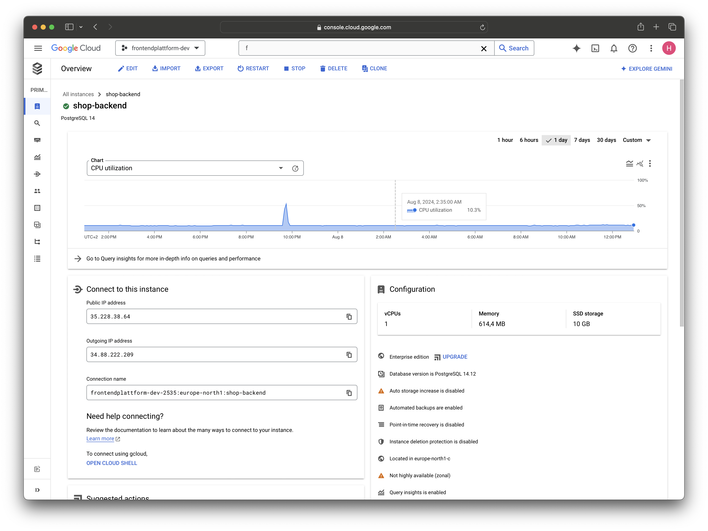
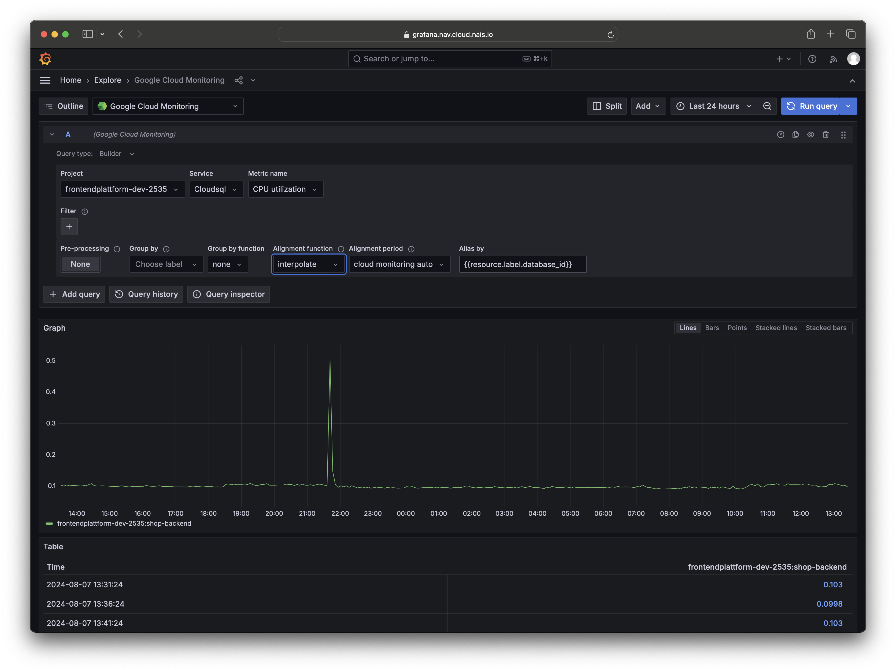
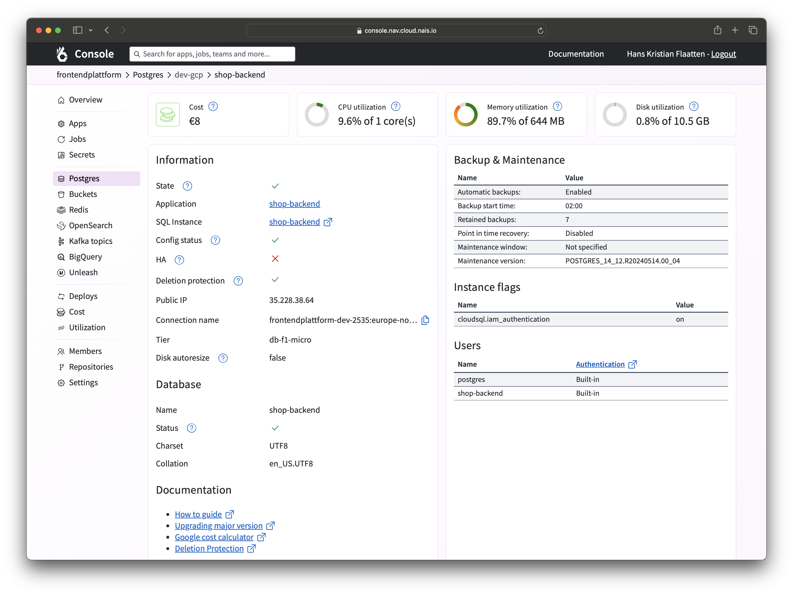

All Postgres databases running on Google Cloud Platform are integrated with [Cloud Monitoring](https://cloud.google.com/monitoring) to provide metrics and alerts. You can use these metrics to monitor the health and performance of your database.

Monitoring data from your datatabse can be viewed directly in the Google Cloud Console, NAIS Console or integraded directly in you Grafana dashboard.

We also suggest keeping an eye on your Query performance using Google Cloud's [Query Insights](https://cloud.google.com/sql/docs/postgres/insights) that is enabled by default on all Postgres instances.

## Viewing Postgres metrics in the Google Cloud Console

To view metrics for your Postgres database, follow these steps:

1. Log on to [Google Cloud Console](https://console.cloud.google.com/).
2. In the navigation pane, click **SQL**.
3. Click the name of your database to view its metrics.
4. From the Overview page you can see the most important metrics for your database.
5. Click **System metrics** to view more detailed metrics.

## Viewing Postgres metrics in your Grafana dashboard

To view Postgres metrics in your Grafana dashboard, you can use the Google Cloud Monitoring datasource. Follow these steps to add the Google Cloud Monitoring datasource to your Grafana dashboard:

1. Log on to [Grafana](<<tenant_url("grafana")>>).
2. In your Grafana dashboard, add a new panel.
3. Select **Google Cloud Monitoring** as the datasource.
4. Select your Google Cloud project.
5. Select **Cloudsql** as the Service.
6. Select the metric you want to display.
7. Add any filters you want to apply to the metric.

!!! info
    You can use the `instance_id` filter to select the specific database instance you want to monitor.

## Viewing Postgres metrics in the NAIS Console

To view metrics for your Postgres database in the NAIS Console, follow these steps:

1. Log on to [NAIS Console](<<tenant_url("console")>>).
2. Select the team that owns the database.
3. In the navigation pane, click **Postgres**.
4. Click the name of your database to view its metrics.

