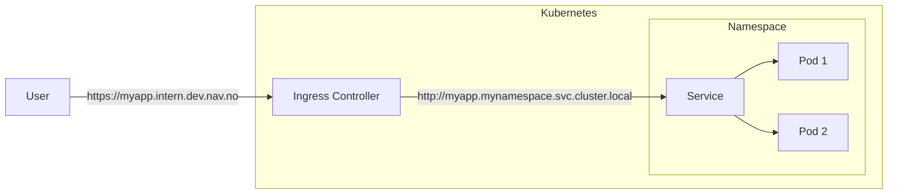

# Ingress traffic

Ingress traffic is traffic that is directed to your application from the Internet. This is done by configuring the [`ingresses`][nais-ingress] block in your NAIS application yaml manifest with the domains you want your application to receive traffic from.

[nais-ingress]: https://doc.nais.io/nais-application/application/#ingresses



If you do not need to expose your application outside the cluster, you can rely on [service discovery][service-discovery] instead.

You can tweak the Ingress configuration by specifying certain [Kubernetes annotations][kubernetes-annotations] in your app spec. A list of supported variables are specified in the [Nginx ingress documentation][nginx-ingress-annotations].

[kubernetes-annotations]: https://kubernetes.io/docs/concepts/overview/working-with-objects/annotations/
[nginx-ingress-annotations]: https://kubernetes.github.io/ingress-nginx/user-guide/nginx-configuration/annotations/
[service-discovery]: https://doc.nais.io/clusters/service-discovery/

As the Nginx ingress documentation states, these parameters are set on the Ingress object. However, Naiserator will copy these parameters from your Application spec.

## Custom max body size

For nginx, an `413` error will be returned to the client when the size in a request exceeds the maximum allowed size of the client request body. By default, this is set to `1m` (1 megabyte).

```yaml
metadata:
  annotations:
    nginx.ingress.kubernetes.io/proxy-body-size: "8m"
```

## Custom proxy buffer size

Sets the size of the buffer proxy_buffer_size used for reading the first part of the response received from the proxied server. By default proxy buffer size is set as `4k`

```yaml
metadata:
  annotations:
    nginx.ingress.kubernetes.io/proxy-buffer-size: "8k"
```

## Custom timeouts

In some scenarios is required to have different values for various timeouts. To allow this we provide parameters that allows this customization:

* `nginx.ingress.kubernetes.io/proxy-connect-timeout`
* `nginx.ingress.kubernetes.io/proxy-send-timeout`
* `nginx.ingress.kubernetes.io/proxy-read-timeout`
* `nginx.ingress.kubernetes.io/proxy-next-upstream`
* `nginx.ingress.kubernetes.io/proxy-next-upstream-timeout`
* `nginx.ingress.kubernetes.io/proxy-next-upstream-tries`
* `nginx.ingress.kubernetes.io/proxy-request-buffering`

Note: All timeout values are unitless and in seconds e.g. `nginx.ingress.kubernetes.io/proxy-read-timeout: "120"` sets a valid 120 seconds proxy read timeout.

## WebSockets Support

Support for websockets is provided by nginx ingress controller out of the box. No special configuration required.

The only requirement to avoid the close of connections is the increase of the values of `proxy-read-timeout` and `proxy-send-timeout`.

The default value of this settings is `60 seconds`.

A more adequate value to support websockets is a value higher than one hour (`3600`).

```yaml
apiVersion: nais.io/v1alpha1
kind: Application
metadata:
  name: myapplication
  namespace: myteam
  annotations:
    nginx.ingress.kubernetes.io/proxy-read-timeout: "600"
    nginx.ingress.kubernetes.io/proxy-send-timeout: "600"
spec:
  ...
```

## Ingress metrics

All requests to your application via ingress will result in metrics being emitted to Prometheus. The metrics are prefixed with `nginx_ingress_controller_requests_` and are tagged with the following labels: `status`, `method`, `host`, `path`, `namespace`, `service`.

??? info "Ingress metrics label descriptions"

    | Label       | Description                    |
    | ----------- | ------------------------------ |
    | `status`    | HTTP status code               |
    | `method`    | HTTP method                    |
    | `host`      | Host header (domain)           |
    | `path`      | Request path                   |
    | `namespace` | Namespace of the ingress       |
    | `service`   | Name of the service (app name) |

### Uptime probes

All ingresses will automatically have uptime probes enabled on them. This probe will directed at the [application's readiness endpoint](./application-spec.md#readiness) using a HTTP GET request. A probe is considered successful if the HTTP status code is `2xx` or `3xx`. The probe is considered failed if the HTTP status code is `4xx` or `5xx`.

You can query the uptime probe status using the following PromQL query:

```promql
probe_success{app="my-app"} == 1
```

### Example PromQL Queries

Number of requests to the `myapp` application, grouped by status code:

```promql
sum by (status) (nginx_ingress_controller_requests{service="myapp", namespace="myteam"})
```

Number of `5xx` errors to the `myapp` application:

```promql
sum(nginx_ingress_controller_requests{service="myapp", namespace="myteam", status=~"5.."})
```

Percentage of `5xx` errors to the `myapp` application as a ratio of total requests:

```promql
100 * (
  sum by (service) (rate(nginx_ingress_controller_requests{status=~"^5\\d\\d", namespace="myteam", service="myapp"}[3m]))
  /
  sum by (service) (rate(nginx_ingress_controller_requests{namespace="myteam", service="myapp"}[3m]))
)
```

## Ingress access logs

Request access logs from nginx ingress controller are automatically collected and stored in Kibana.

Here are pre-configured queries for the controller logs in the following clusters:

* [dev-gcp](https://logs.adeo.no/goto/82988ce0-3396-11ed-b3e8-d969437dd878)
* [prod-gcp](https://logs.adeo.no/goto/8ac4d5e0-3396-11ed-b3e8-d969437dd878)
* [dev-fss](https://logs.adeo.no/goto/97748420-3396-11ed-b3e8-d969437dd878)
* [prod-fss](https://logs.adeo.no/goto/a2b58730-3396-11ed-b3e8-d969437dd878)

### Log fields description

| Field               | Description                                                                                    |
| ------------------- | ---------------------------------------------------------------------------------------------- |
| `message`           | HTTP request on the following format: "`method` `path` `httpVersion`"                          |
| `response_code`     | HTTP response code from nginx                                                                  |
| `x_upstream_name`   | The application receiving the request on the following format "`namespace`-`app-name`-`port`"  |
| `x_upstream_status` | HTTP response code from the application                                                        |
| `x_request_id`      | Unique request ID used for correlating further requests from the application to other services |

### Find _your_ access logs

In order to find your team's application access logs, you need to filter on the following fields:

* `AND x_upstream_name: my-namespace*` (replace `my-namespace` with your namespace)

If you want to filter on a specific application, you can add the following filter:

* `AND x_upstream_name: my-namespace-my-app*` (replace `my-namespace` with your namespace and `my-app` with your application name)

If you want to filter out specific HTTP response codes, you can add the following filter:

* `NOT response_code: 404` (replace `404` with the HTTP response code you want to filter out)

If you want to filter out multiple HTTP response codes, you can add the following filter:

* `NOT response_code: (404 or 503)` (replace `404` and `503` with the HTTP response codes you want to filter out)

If you want to find specific HTTP methods, you can add the following filter:

* `AND message: GET*` (replace `GET` with the HTTP method you want to filter out)

### Disable _your_ access logs

!!! note "Not reccomended"
    Running without access logs is not reccomended and will limit your ability to audit or debug connection problems with your application.

In some cases (such as legcay applications that are using personally identifiable information as URL parameters) you might want to disable access logs for a given application. This can be done by setting the following annotation in your nais yaml:

```yaml
apiVersion: nais.io/v1alpha1
kind: Application
metadata:
  name: myapplication
  namespace: myteam
  annotations:
    nginx.ingress.kubernetes.io/enable-access-log: "false"
spec:
  ...
```

To keep personal identifiable information out of access logs use POST data instead or switch to user identifiers that are unique to your application or domain.

### Some debugging tips

If `response_code` and `x_upstream_status` are the same it means that the application returned this response code – not nginx. Look in the logs for the corresponding application, this is not a problem with nginx.

Here are some suggestions depending on what http status code you might recieve from nginx:

| Code                           | Suggestion                                                                                                                                                                                                                                               |
| ------------------------------ | -------------------------------------------------------------------------------------------------------------------------------------------------------------------------------------------------------------------------------------------------------- |
| `400 Bad Request`              | If nginx returns `401` error with no further explanation and there is no `x_upstream_name` it means that nginx received an invalid request before it could be sent to the backend. One of the most common problems is duplicate `Authorization` headers. |
| `413 Request Entity Too Large` | If nginx return `413` error it means that the request body is too large. This can be caused by a large file upload or a large request body. The solution is to add the `proxy-body-size` ingress parameter to an appropriate size.                       |
| `502 Bad Gateway`              | If nginx return `502` error but the application is returning a `2xx` status code it might be caused by large response headers often cookies. The solution is the add the `proxy-buffer-size` to an appropriate size.                                     |

## Full ingress example

=== "nais.yaml"

    ```yaml
    apiVersion: nais.io/v1alpha1
    kind: Application
    metadata:
      name: myapplication
      namespace: myteam
      annotations:
        nginx.ingress.kubernetes.io/proxy-body-size: "256M"
        nginx.ingress.kubernetes.io/proxy-buffer-size: "8k"
        nginx.ingress.kubernetes.io/proxy-read-timeout: "300"
    spec:
      service:
        protocol: http
      ingresses:
        - https://myapplication.nav.no
    ```

=== "ingress.yaml"

    ```yaml
    apiVersion: extensions/v1beta1
    kind: Ingress
    metadata:
      name: myapplication-gw-nav-no-abcd1234
      namespace: myteam
      annotations:
        nginx.ingress.kubernetes.io/backend-protocol: "HTTP"    # from ".service.protocol"
        nginx.ingress.kubernetes.io/use-regex: "true"           # this is always on
        nginx.ingress.kubernetes.io/proxy-body-size: "256M"     # copied from annotations
        nginx.ingress.kubernetes.io/proxy-buffer-size: "8k"     # copied from annotations
        nginx.ingress.kubernetes.io/proxy-read-timeout: "300"   # copied from annotations
    ```
