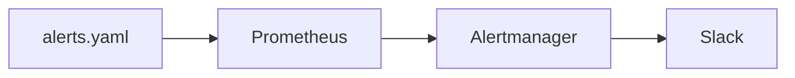

# Prometheus Alerting Rule Reference

[Prometheus alerts][prometheus-alerting-rule] are defined in a `PrometheusRule` resource. This resource is part of the [Prometheus Operator][prometheus-operator] and is used to define alerts that should be sent to the Alertmanager.

[Alertmanager][alertmanager] is a component of the Prometheus project that handles alerts sent by client applications such as the Prometheus server. It takes care of deduplicating, grouping, and routing them to the correct Slack channel.

Prometheus alerts are defined using the [PromQL](../metrics/promql.md) query language. The query language is used to specify when an alert should fire, and the `PrometheusRule` resource is used to specify the alert and its properties.

Prometheus alerts are sent to the team's Slack channel configured in [nais teams](../../../explanation/team.md) when the alert fires.



[prometheus-operator]: https://github.com/prometheus-operator/prometheus-operator
[alertmanager]: https://prometheus.io/docs/alerting/latest/alertmanager/
[prometheus-alerting-rule]: https://prometheus.io/docs/prometheus/latest/configuration/alerting_rules/

## `PrometheusRule`

??? note ".nais/alert.yaml"

    ```yaml
    apiVersion: monitoring.coreos.com/v1
    kind: PrometheusRule
    metadata:
      labels:
        team: my-team
      name: my-alerts
      namespace: my-team
    spec:
      groups:
      - name: my-alert-rules
        rules:
        - alert: HighCPUUsage
          expr: 100 - (avg by (instance) (irate(node_cpu_seconds_total{mode="idle"}[5m])) * 100) > 80
          for: 10m
          labels:
            severity: warning
          annotations:
            consequence: The high CPU usage may impact the performance of the application.
            action: Investigate the cause of high CPU usage and optimize the application if necessary.
            summary: High CPU usage for more than 10 minutes.
    ```

### `groups[]`

A `PrometheusRule` can contain multiple groups of rules. Each group can contain multiple alert rules.

#### `groups[].name`

The name of the group. This is used to group alerts in the Alertmanager.

#### `groups[].rules[]`

##### `groups[].rules[].alert`

The name of the alert. This is used to identify the alert in the Alertmanager. Typically this is a short, descriptive name on the form `CamelCase`.

##### `groups[].rules[].expr`

The expression that defines when the alert should fire. This is a PromQL expression that should evaluate to `true` when the alert should fire.

We suggest using the Explore page in Grafana to build and test your PromQL expressions before creating a `PrometheusRule`.

##### `groups[].rules[].for`

For how long time the `expr` must evaluate to `true` before firing the alert. This is used to prevent flapping alerts and alerting on temporary spikes in metrics.

When the `expr` first evaluates to `true` the alert will be in `pending` state for the duration specified.

Example values: `30s`, `5m`, `1h`.

##### `groups[].rules[].labels`

Labels to attach to the alert. These are used to group and filter alerts in the Alertmanager.

###### `groups[].rules[].labels.severity`

This will affect what color the notification gets. Possible values are `critical` (🔴), `warning` (🟡) and `notice` (🟢).

#### `groups[].rules[].annotations`

##### `groups[].rules[].annotations.consequence` (optional)

The consequence annotation is used to describe what happens in the world when this alert fires. This is useful for the one receiving the alert to understand the impact of the alert.

##### `groups[].rules[].annotations.action` (optional)

The action annotation is used to describe what the best course of action is to resolve the issue. Good alerts should have a clear action that can be taken to resolve the issue.

##### `groups[].rules[].annotations.summary` (optional)

The summary annotation is used to give a short description of the alert. This is useful for the one receiving the alert to understand what the alert is about.
