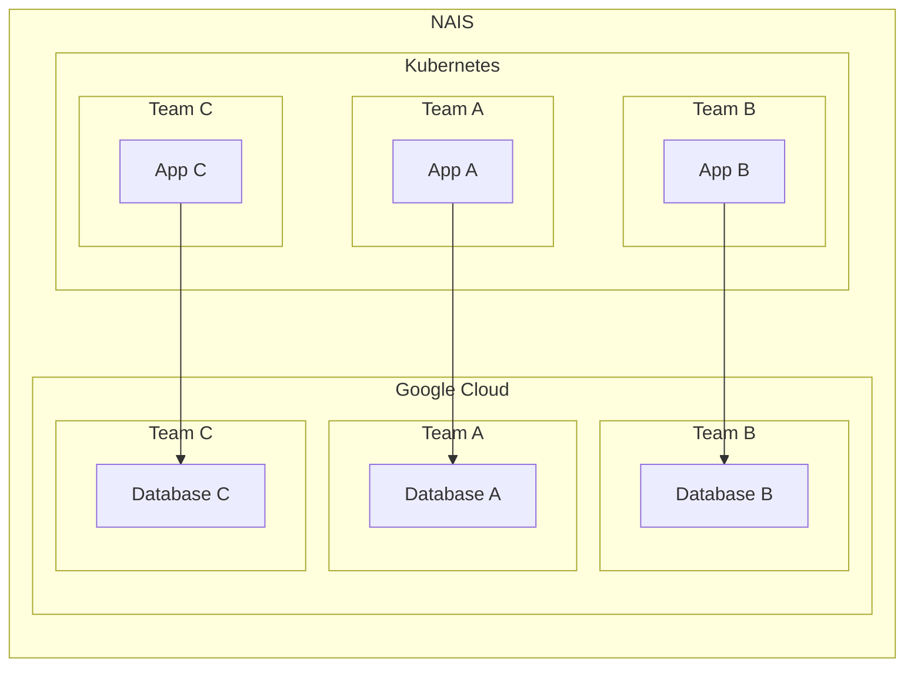

# Security in NAIS

NAIS is a platform for building, deploying and operating applications in a
secure manner. This document describes on a high level how NAIS achieves this
and what is expected of those who use NAIS.

## Shared responsibility

NAIS is a shared responsibility between the application team and the NAIS
platform team. The platform team is responsible for providing securing the
underlying infrastructure and providing the tools and necessary for secure
software development lifecycle, and the application team is responsible for
using these tools and following the guidelines provided by the platform team.

## Security Principles

NAIS is built on the following security principles:

1. **Defense in depth** - NAIS is built on the principle of defense in depth.
This means that security is built into every layer of the platform, from the
underlying infrastructure to the application code. This is achieved by using
multiple layers of security controls, so that if one layer fails, the next layer
will provide protection.

1. **Least privilege** - NAIS is built on the principle of least privilege. This
means that every component of the platform is given the minimum amount of
privileges necessary to perform its function. This is achieved by using
role-based access control (RBAC) and by using the principle of separation of
duties.

1. **Secure by default** - NAIS is built on the principle of secure by default.
This means that every component of the platform is configured to be secure by
default. This is achieved by using secure defaults and by using the principle of
least privilege.

1. **Secure by design** - NAIS is built on the principle of secure by design.
This means that every component of the platform is designed to be secure by
design. This is achieved by using secure design patterns and by using the
principle of least privilege.

## Team isolation

NAIS is built on the principle of team isolation. This means that every team has
its own isolated environment, which is only accessible by the team members. This
is achieved by using the principle of least privilege and by using the principle
of separation of duties.

Each team has its own isolated environment, which is only accessible by the
members of the team. This is achieved by creating a separate Kubernetes
namespace and Google Cloud project that is only accessible by the members of the
team.

Teams are managed in [NAIS Teams](../basics/teams.md).

## Secure Software Development Lifecycle (Secure SDLC)

NAIS is not a complete solution for secure software development lifecycle. It is
a platform for building, deploying and operating applications in a secure manner
as a part of a larger secure software development lifecycle.

Here is a high level overview of the secure software development lifecycle
provided by NAIS:

1. Build-phase
    1. [Secrets](#secrets)
    1. [External dependencies](#external-dependencies)

1. Deploy-phase
    1. [Supply-chain Levels for Software Artifacts (SLSA)](#slsa)
    1. [Security Policies](#security-policies)

1. Operate-phase
    1. Access control
    1. User authentication
    1. Network security
    1. Logging

### Build

#### Secrets

NAIS provides a secure way to store secrets in the form of [Kubernetes
secrets][kubernetes-secrets]. These secrets are encrypted at rest and are only
accessible by the application that they are associated with.

In addition to Kubernetes secrets NAIS provides integration with [Google Secrets
Manager][google-secrets-manager] and [Hashicorp Vault][hashicorp-vault] for
enhanced secret management.

[kubernetes-secrets]: ./secrets/kubernetes-secrets.md
[google-secrets-manager]: ./secrets/google-secrets-manager.md
[hashicorp-vault]: ./secrets/vault.md

#### External dependencies

NAIS provides a secure way to provision external dependencies like databases and
message queues. These external dependencies are created as a part of the
application deployment process and are only accessible by the application that
they are associated with and nothing else.

External dependencies are created with secure defaults and continuously updated
by NAIS and our service providers to ensure that they stay secure over time.

NAIS provides the following external dependencies:

| Service                                    | Description          | Provider                                                 |
| ------------------------------------------ | -------------------- | -------------------------------------------------------- |
| [PostgreSQL](../persistence/postgres.md)   | Relational database  | [Google Cloud SQL](https://cloud.google.com/sql)         |
| [Buckets](../persistence/bigquery.md)      | Object storage       | [Google Cloud Storage](https://cloud.google.com/storage) |
| [BigQuery](../persistence/bigquery.md)     | Data warehouse       | [Google BigQuery](https://cloud.google.com/bigquery)     |
| [InfluxDB](../persistence/influxdb.md)     | Time series database | [Aiven Influx](https://aiven.io/influxdb)                |
| [Redis](../persistence/redis.md)           | In-memory database   | [Aiven Redis](https://aiven.io/redis)                    |
| [OpenSearch](../persistence/opensearch.md) | Search engine        | [Aiven OpenSearch](https://aiven.io/opensearch)          |
| [Kafka](../persistence/kafka/README.md)    | Message queues       | [Aiven Kafka](https://aiven.io/kafka)                    |

Read more about [external dependencies](../persistence/README.md) and [responsibilities](../persistence/responsibilities.md).

### Deploy

#### SLSA

NAIS provides a secure way to deploy applications using [Supply-chain Levels for
Software Artifacts (SLSA)][slsa]. This means that every application is deployed
using a secure supply chain that ensures that the application is deployed in a
secure manner.

[slsa]: ./salsa/salsa.md

#### Security Policies

NAIS provides a secure way to enforce security policies on applications using
[Kyverno][kyverno] policy engine. This means that every application is deployed
with a set of security policies that ensure that the application is deployed in
a secure manner.

The following security policies are enforced by NAIS:

| Policy                           | Description                                                                                                                                                                                                                                                                                                                                                            |
| -------------------------------- | ---------------------------------------------------------------------------------------------------------------------------------------------------------------------------------------------------------------------------------------------------------------------------------------------------------------------------------------------------------------------- |
| `deny-image-registries`          | Deny images from registries not on the list of allowed registries. See documentation: https://docs.nais.io/deployment/allowed-registries                                                                                                                                                                                                                               |
| `deny-specific-service-types`    | This policy denies the creation of services with types other than `ClusterIP` and `ExternalName`.                                                                                                                                                                                                                                                                      |
| `disallow-host-namespaces`       | Host namespaces (Process ID namespace, Inter-Process Communication namespace, and network namespace) allow access to shared information and can be used to elevate privileges. Pods should not be allowed access to host namespaces. This policy ensures fields which make use of these host namespaces are unset or set to `false`.                                   |
| `disallow-host-path`             | HostPath volumes let Pods use host directories and volumes in containers. Using host resources can be used to access shared data or escalate privileges and should not be allowed. This policy ensures no hostPath volumes are in use.                                                                                                                                 |
| `disallow-host-ports`            | Access to host ports allows potential snooping of network traffic and should not be allowed, or at minimum restricted to a known list. This policy ensures the `hostPort` field is unset or set to `0`.                                                                                                                                                                |
| `disallow-host-process`          | Windows pods offer the ability to run HostProcess containers which enables privileged access to the Windows node. Privileged access to the host is disallowed in the baseline policy. HostProcess pods are an alpha feature as of Kubernetes v1.22. This policy ensures the `hostProcess` field, if present, is set to `false`.                                        |
| `disallow-privilege-escalation`  | Privilege escalation, such as via set-user-ID or set-group-ID file mode, should not be allowed. This policy ensures the `allowPrivilegeEscalation` field is set to `false`.                                                                                                                                                                                            |
| `disallow-privileged-containers` | Privileged mode disables most security mechanisms and must not be allowed. This policy ensures Pods do not call for privileged mode.                                                                                                                                                                                                                                   |
| `disallow-proc-mount`            | The default /proc masks are set up to reduce attack surface and should be required. This policy ensures nothing but the default procMount can be specified. Note that in order for users to deviate from the `Default` procMount requires setting a feature gate at the API server.                                                                                    |
| `disallow-selinux`               | SELinux options can be used to escalate privileges and should not be allowed. This policy ensures that the `seLinuxOptions` field is undefined.                                                                                                                                                                                                                        |
| `restrict-apparmor-profiles`     | On supported hosts, the 'runtime/default' AppArmor profile is applied by default. The default policy should prevent overriding or disabling the policy, or restrict overrides to an allowed set of profiles. This policy ensures Pods do not specify any other AppArmor profiles than `runtime/default` or `localhost/*`.                                              |
| `restrict-sysctls`               | Sysctls can disable security mechanisms or affect all containers on a host, and should be disallowed except for an allowed "safe" subset. A sysctl is considered safe if it is namespaced in the container or the Pod, and it is isolated from other Pods or processes on the same Node. This policy ensures that only those "safe" subsets can be specified in a Pod. |
| `restrict-volume-types`          | In addition to restricting HostPath volumes, the restricted pod security profile limits usage of non-core volume types to those defined through PersistentVolumes. This policy blocks any other type of volume other than those in the allow list.                                                                                                                     |
| `validate-ephemeral-containers`  | Ephemeral containers must use allowed images and have limited capabilities. When using 'kubectl debug' please set flag `--profile=restricted`. For-example: `kubectl debug -it --image=cgr.dev/chainguard/busybox:latest --profile=restricted`                                                                                                                         |

[kyverno]: https://kyverno.io/

## References

* [Google Cloud Architecture Framework: Security, privacy, and compliance](https://cloud.google.com/architecture/framework/security)
* [Security Pillar - AWS Well-Architected Framework](https://docs.aws.amazon.com/wellarchitected/latest/security-pillar/welcome.html)
