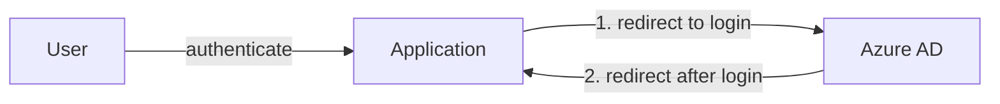
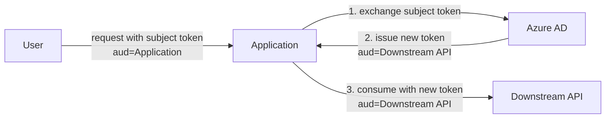
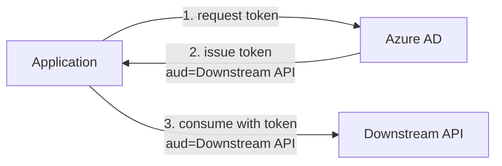

# Usage

## Use Cases

An Azure AD client allows your application to leverage Azure AD for authentication and/or authorization. The following
sections will describe the recommended flows and grants to be used for applications running on the platform.

### OpenID Connect Authorization Code Flow

This flow is used for signing in and authenticating end-users (NAV employees only) with single-sign on (SSO).



We generally recommend that you use the [sidecar](sidecar.md) instead of implementing this yourselves.

If you don't want to use the sidecar, see [Microsoft identity platform and OAuth 2.0 authorization code flow](https://docs.microsoft.com/en-us/azure/active-directory/develop/v2-oauth2-auth-code-flow) for further details.

### OAuth 2.0 On-Behalf-Of Grant

This grant is used for machine-to-machine requests chains initiated by an end user. The end user's identity and
permissions should be propagated through each application.



Your application receives requests from a user.
These requests contain the user's token, known as the _subject token_.
The token has an audience (`aud`) [claim](../../../auth/explanations/README.md#claims-validation) equal to _your own_ client ID.

To access a downstream API _on-behalf-of_ the user, we need a token [scoped](README.md#scopes) to the downstream API.
That is, the token's audience must be equal to the _downstream API's_ client ID.
We achieve this by exchanging the subject token for a new token.

The same principles apply if your application is a downstream API itself and needs to access another downstream API on-behalf-of the user.

**Prerequisites**

1. Your application and the downstream API that you want to consume both have [enabled Azure AD](configuration.md).
2. Your application has been [granted access](configuration.md#pre-authorization) to the downstream API.

**Steps**

1. [Validate the subject token](#token-validation) from the incoming request.
2. Request a new token that is scoped to the downstream API.
    - Set the `scope` parameter to `api://<cluster>.<namespace>.<outbound-app-name>/.default`
    - Request:
    ```http
    POST ${AZURE_OPENID_CONFIG_TOKEN_ENDPOINT} HTTP/1.1
    Content-Type: application/x-www-form-urlencoded

    grant_type=urn:ietf:params:oauth:grant-type:jwt-bearer
    &client_id=${AZURE_APP_CLIENT_ID}
    &client_secret=${AZURE_APP_CLIENT_SECRET}
    &assertion=<subject_token>
    &scope=api://<cluster>.<namespace>.<outbound-app-name>/.default
    &requested_token_use=on_behalf_of
    ```

    - Response (token omitted for brevity):
    ```json
    {
      "access_token" : "eyJ0eX[...]",
      "expires_in" : 3599,
      "token_type" : "Bearer"
    }
    ```

        !!! tip "Token Caching"

            The `expires_in` field denotes the lifetime of the token in seconds.
        
            **Cache and reuse the token until it expires** to minimize network latency impact.
        
            A safe cache key for on-behalf-of tokens is `key = sha256($subject_token + $scope)`.

    - The new token has an audience equal to the downstream API. Your application does not need to validate this token.

3. Consume the downstream API by using the new token as a [Bearer token](../../../auth/explanations/README.md#bearer-token). The downstream API [validates the token](#token-validation) and returns a response.
4. Repeat step 2 and 3 for each unique API that your application consumes.
5. The downstream API(s) may continue the call chain starting from step 1.

For further details, see [Microsoft identity platform and OAuth 2.0 On-Behalf-Of flow](https://docs.microsoft.com/en-us/azure/active-directory/develop/v2-oauth2-on-behalf-of-flow).

### OAuth 2.0 Client Credentials Grant

This grant is used for pure machine-to-machine authentication, i.e. interactions without an end user involved.



To access a downstream API, we need a token [scoped](README.md#scopes) to the downstream API.
That is, the token's audience must be equal to the _downstream API's_ client ID.

**Prerequisites**

1. Your application and the downstream API that you want to consume both have [enabled Azure AD](configuration.md).
2. Your application has been [granted access](configuration.md#pre-authorization) to the downstream API.

**Steps**

1. Request a new token that is scoped to the downstream API.
    - Set the `scope` parameter to `api://<cluster>.<namespace>.<outbound-app-name>/.default`
    - Request:
    ```http
    POST ${AZURE_OPENID_CONFIG_TOKEN_ENDPOINT} HTTP/1.1
    Content-Type: application/x-www-form-urlencoded

    client_id=${AZURE_APP_CLIENT_ID}
    &client_secret=${AZURE_APP_CLIENT_SECRET}
    &scope=api://<cluster>.<namespace>.<outbound-app-name>/.default
    &grant_type=client_credentials
    ```

    - Response (token omitted for brevity):
    ```json
    {
      "access_token" : "eyJ0eX[...]",
      "expires_in" : 3599,
      "token_type" : "Bearer"
    }
    ```

        !!! tip "Token Caching"

            The `expires_in` field denotes the lifetime of the token in seconds.
        
            **Cache and reuse the token until it expires** to minimize network latency impact.
        
            A safe cache key for client credentials tokens is `key = $scope`.

    - The new token has an audience equal to the downstream API. Your application does not need to validate this token.

2. Consume downstream API by using the token as a [Bearer token](../../../auth/explanations/README.md#bearer-token). The downstream API [validates the token](#token-validation) and returns a response.
3. Repeat step 1 and 2 for each unique API that your application consumes.
4. The downstream API(s) may continue the call chain by starting from step 1.

For further details, see [Microsoft identity platform and the OAuth 2.0 client credentials flow](https://docs.microsoft.com/en-us/azure/active-directory/develop/v2-oauth2-client-creds-grant-flow).

## Runtime Variables & Credentials

Your application will automatically be injected with both environment variables and files at runtime.
You can use whichever is most convenient for your application.

The files are available at the following path: `/var/run/secrets/nais.io/azure/`

#### Variables for Acquiring Tokens

These variables are used for acquiring tokens using the [client credentials grant](#oauth-20-client-credentials-grant) or the [on-behalf-of grant](#oauth-20-on-behalf-of-grant):

| Name                                 | Description                                                                                                      |
|:-------------------------------------|:-----------------------------------------------------------------------------------------------------------------|
| `AZURE_APP_CLIENT_ID`                | [Client ID](../../../auth/explanations/README.md#client-id) that uniquely identifies the application in Azure AD.                      |
| `AZURE_APP_CLIENT_SECRET`            | [Client secret](../../../auth/explanations/README.md#client-secret) for the application in Azure AD.                                   |
| `AZURE_APP_JWK`                      | Optional. [Private JWK](../../../auth/explanations/README.md#private-keys) (RSA) for the application.                                  |
| `AZURE_OPENID_CONFIG_TOKEN_ENDPOINT` | `token_endpoint` from the [metadata discovery document](../../../auth/explanations/README.md#token-endpoint).                          |
| `AZURE_APP_WELL_KNOWN_URL`           | The well-known URL for the [metadata discovery document](../../../auth/explanations/README.md#well-known-url-metadata-document).       |

`AZURE_APP_WELL_KNOWN_URL` is optional if you're using `AZURE_OPENID_CONFIG_TOKEN_ENDPOINT` directly.

`AZURE_APP_JWK` contains a private key that can be used to sign JWT [_client assertions_](../../../auth/explanations/README.md#client-assertion). 
This is an alternative client authentication method that can be used instead of _client secrets_.
For further details, see Microsoft's documentation on [certificate credentials](https://learn.microsoft.com/en-us/azure/active-directory/develop/certificate-credentials).
The `aud` claim in the JWT assertions should be set to the value of the `AZURE_OPENID_CONFIG_TOKEN_ENDPOINT` environment variable. 

#### Variables for Validating Tokens

These variables are used for [token validation](#token-validation):

| Name                           | Description                                                                                                     |
|:-------------------------------|:----------------------------------------------------------------------------------------------------------------|
| `AZURE_APP_CLIENT_ID`          | [Client ID](../../../auth/explanations/README.md#client-id) that uniquely identifies the application in Azure AD.                     |
| `AZURE_OPENID_CONFIG_ISSUER`   | `issuer` from the [metadata discovery document](../../../auth/explanations/README.md#issuer).                                         |
| `AZURE_OPENID_CONFIG_JWKS_URI` | `jwks_uri` from the [metadata discovery document](../../../auth/explanations/README.md#jwks-endpoint-public-keys).                    |
| `AZURE_APP_WELL_KNOWN_URL`     | The well-known URL for the [metadata discovery document](../../../auth/explanations/README.md#well-known-url-metadata-document).      |

`AZURE_APP_WELL_KNOWN_URL` is optional if you're using `AZURE_OPENID_CONFIG_ISSUER` and `AZURE_OPENID_CONFIG_JWKS_URI` directly.

## Token Validation

Verify incoming requests by validating the [Bearer token](../../../auth/explanations/README.md#bearer-token) in the `Authorization` header.

Always validate the [signature and standard time-related claims](../../../auth/explanations/README.md#token-validation).
Additionally, perform the following validations:

**Issuer Validation**

Validate that the `iss` claim has a value that is equal to either:

1. the `AZURE_OPENID_CONFIG_ISSUER` [environment variable](#variables-for-validating-tokens), or 
2. the `issuer` property from the [metadata discovery document](../../../auth/explanations/README.md#well-known-url-metadata-document).
    The document is found at the endpoint pointed to by the `AZURE_APP_WELL_KNOWN_URL` environment variable.

**Audience Validation**

Validate that the `aud` claim is equal to the `AZURE_APP_CLIENT_ID` environment variable.

**Signature Validation**

Validate that the token is signed with a public key published at the JWKS endpoint.
This endpoint URI can be found in one of two ways:

1. the `AZURE_OPENID_CONFIG_JWKS_URI` environment variable, or
2. the `jwks_uri` property in the metadata discovery document.
   The document is found at the endpoint pointed to by the `AZURE_APP_WELL_KNOWN_URL` environment variable.

### Other Token Claims

Other claims may be present in the token.
Validation of these claims is optional.

Notable claims:

- `azp` (**authorized party**)
    - The [client ID](../../../auth/explanations/README.md#client-id) of the application that requested the token (this would be your consumer).
- `azp_name` (**authorized party name**)
    - The value of this claim is the (human-readable) [name](README.md#client-name) of the consumer application that requested the token.
- `groups` (**groups**)
    - JSON array of object IDs for [Azure AD groups](README.md#groups).
    - This claim only applies in flows where a user is involved i.e., either the [sign-in](#openid-connect-authorization-code-flow) or [on-behalf-of](#oauth-20-on-behalf-of-grant) flows.
    - In order for a group to appear in the claim, all the following conditions must be true:
        - The given user is a direct member of the group.
        - The group is [assigned to the client](configuration.md#groups).
- `idtyp` (**identity type**)
    - This is a special claim used to determine whether a token is a [machine-to-machine](#oauth-20-client-credentials-grant) (app-only) token or a user/[on-behalf-of](#oauth-20-on-behalf-of-grant) token.
    - The claim currently only appears in machine-to-machine tokens. The value is `app` when the token is a machine-to-machine token.
    - In short: if the `idtyp` claim exists and it has the value `app`, then it is a machine-to-machine token. Otherwise, it is a user/on-behalf-of token.
- `NAVident` (**NAV ident**)
    - The value of this claim maps to an internal identifier for the employees in NAV.
    - This claim thus only applies in flows where a user is involved i.e., either the [sign-in](#openid-connect-authorization-code-flow) or [on-behalf-of](#oauth-20-on-behalf-of-grant) flows.
- `roles` (**roles**)
    - The value of this claim is an _array of strings_ that lists the roles that the application has access to:
    ```json
    {
      "roles": [
        "access_as_application",
        "role-a",
        "role-b"
      ]
    }
    ```
    - This claim **only** applies to [machine-to-machine](#oauth-20-client-credentials-grant) tokens.
    - Consumers defined in the [access policy](configuration.md#applications) are always assigned the default role named `access_as_application`.
    - You can optionally define and grant additional [custom roles](configuration.md#custom-roles) to consumers.
- `scp` (**scope**)
    - The value of this claim is a _space-separated string_ that lists the scopes that the application has access to:
    ```json
    {
       "scp": "defaultaccess scope1 scope2"
    }
    ```
    - This claim **only** applies to user or [on-behalf-of](#oauth-20-on-behalf-of-grant) tokens.
    - Consumers defined in the [access policy](configuration.md#applications) are always assigned the default scope named `defaultaccess`.
    - You can optionally define and grant additional [custom scopes](configuration.md#custom-scopes) to consumers.

For a complete list of claims, see the [Access Token Claims Reference in Azure AD](https://learn.microsoft.com/en-us/azure/active-directory/develop/access-token-claims-reference).
Tokens in NAV are v2.0 tokens.

## Local Development

See also the [development overview](../../../auth/reference/README.md) page.

### Token Generator

In many cases, you want to locally develop and test against a secured API in the development environments.
To do so, you need a [token](../../../auth/explanations/README.md#bearer-token) to access said API.

Use <https://azure-token-generator.intern.dev.nav.no> to generate tokens in the development environments.

**Prerequisites**

1. The API application must be configured with [Azure enabled](../azure-ad/configuration.md). Using the [`nav.no` tenant](../azure-ad/README.md#tenants) is not supported.
2. You will need a [trygdeetaten.no user](../azure-ad/README.md#tenants) to access the service.
3. Pre-authorize the token generator service by adding it to the API application's [access policy](../azure-ad/configuration.md#pre-authorization):
    ```yaml
    spec:
      accessPolicy:
        inbound:
          rules:
            - application: azure-token-generator
              namespace: aura
              cluster: dev-gcp
    ```
4. Ensure that the API application has configured the appropriate [user access policies](../azure-ad/configuration.md#users) that grant your user access.

**Getting a token**

The Azure AD token generator supports two use cases:

1. The [on-behalf-of grant](../azure-ad/usage.md#oauth-20-on-behalf-of-grant) - for getting a token on-behalf-of a logged in end-user.
2. The [client credentials grant](../azure-ad/usage.md#oauth-20-client-credentials-grant) - for getting a machine-to-machine token.

Choose your use case:

1. For _on-behalf-of_: visit <https://azure-token-generator.intern.dev.nav.no/api/obo?aud=&lt;audience&gt;> in your browser.
2. For _client credentials_: visit <https://azure-token-generator.intern.dev.nav.no/api/m2m?aud=&lt;audience&gt;> in your browser.

Then:

1. Replace `<audience>` with the intended _audience_ of the token, in this case the API application.
    - The audience value must be on the form of `<cluster>:<namespace>:<application>`
    - For example: `dev-gcp:aura:my-app`
2. You will be redirected to log in at Azure AD (if not already logged in).
3. After logging in, you should be redirected back to the token generator and presented with a JSON response containing an `access_token`.
4. Use the `access_token` as a [Bearer token](../../../auth/explanations/README.md#bearer-token) for calls to your API application.
5. Success!
