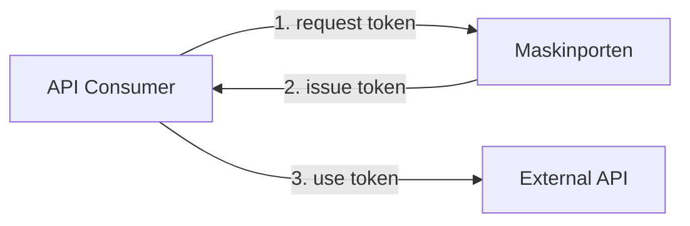
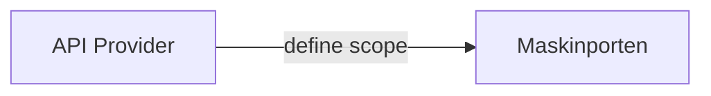
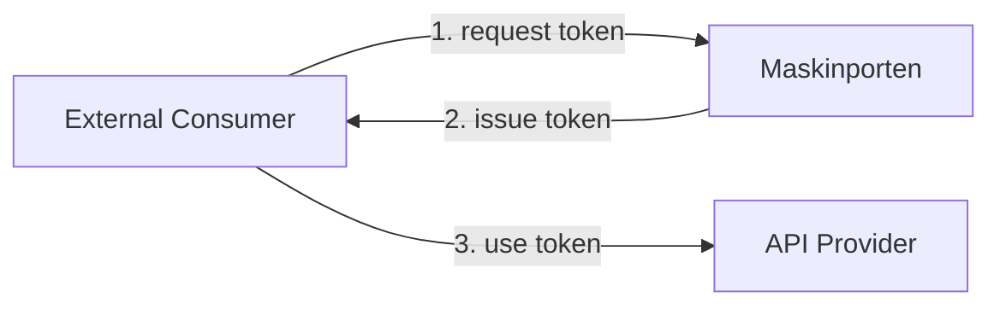

# Maskinporten

[Maskinporten](https://docs.digdir.no/maskinporten_overordnet.html) is a service provided by DigDir that allows API providers to securely enforce server-to-server authorization of their exposed APIs using OAuth 2.0 JWT grants.

The NAIS platform provides support for declarative registration of Maskinporten resources. These cover two distinct use cases:

## For API Consumers

A _client_ allows your application to integrate with Maskinporten to acquire access tokens.
These tokens authenticate your application when consuming external APIs whom require Maskinporten tokens.

[:octicons-arrow-right-24: Get started with a Maskinporten Client](client.md)

## For API Providers

A _scope_ represents a permission that a given consumer has access to.
In Maskinporten, you can define scopes and grant other organizations access to these scopes.

When a consumer requests a token for a given scope, Maskinporten will enforce authorization checks and only issue a token if the consumer has access to the scope.

[:octicons-arrow-right-24: Get started with Maskinporten Scopes](scopes.md)
