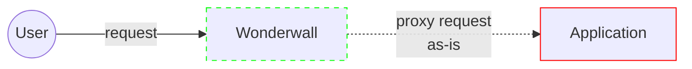
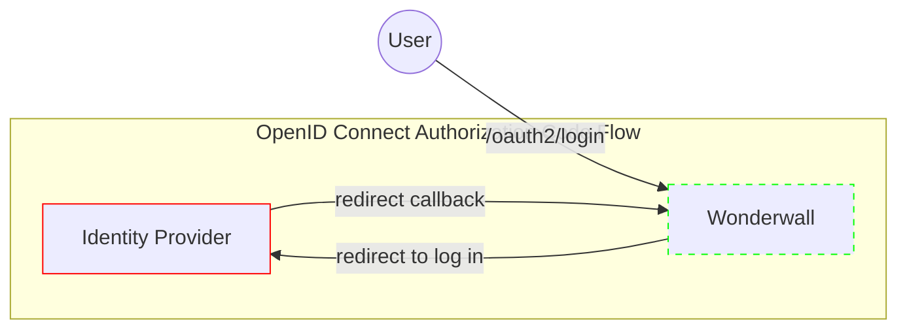
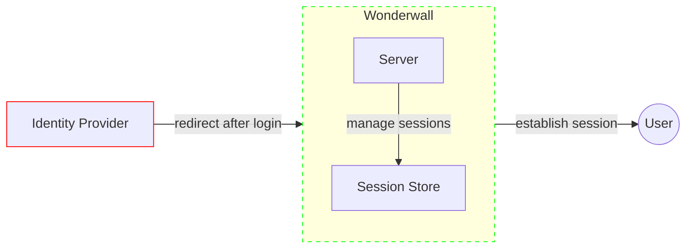
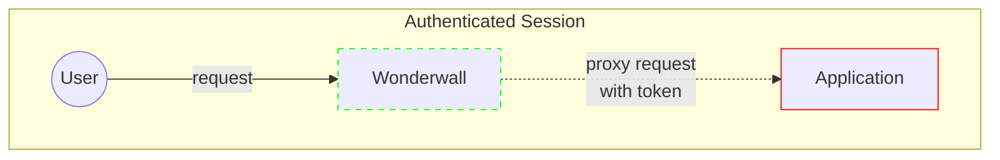

# Wonderwall (sidecar for authentication)

[Wonderwall](https://github.com/nais/wonderwall) is an application that implements an OpenID Connect (OIDC)
[Relying Party](../../auth/explanations/README.md#client) in a way that makes it easy to plug into Kubernetes
as a _sidecar_.

As such, this is OIDC as a sidecar, or OaaS, or to explain the joke:

> _Oasis - Wonderwall_

!!! warning "Availability"
    Wonderwall is only available in the [Google Cloud Platform](../../workloads/reference/environments.md#google-cloud-platform-gcp) environments.

## Overview

Wonderwall is a reverse proxy that sits in front of your application.
All incoming requests to your application are intercepted and proxied by the sidecar.

If the user does _not_ have a valid session with the sidecar, requests will be proxied as-is without modifications to the application:



To obtain a local session, the user must be redirected to the `/oauth2/login` endpoint.
This will initiate the [OpenID Connect Authorization Code Flow](../../auth/explanations/README.md#openid-connect):



If the user successfully completed the login flow, the sidecar creates and stores a session.
A corresponding session cookie is created and set before finally redirecting the user agent back to the application:



All authenticated requests that are forwarded to the application will now contain the user's `access_token`.
The token is sent as a [Bearer token](../../auth/explanations/README.md#bearer-token) in the `Authorization` header.
This applies as long as the [session is not _expired_ or _inactive_](#5-sessions):



Generally speaking, the recommended approach when using the Wonderwall sidecar is to put it in front of 
your backend-for-frontend server that serves your frontend. Otherwise, you might run into issues with the cookie 
configuration and allowed redirects - these are both effectively restricted to only match the domain and path for your 
application's ingress.

## Endpoints

The sidecar provides these endpoints under your application's [ingress](../../workloads/reference/ingress.md):

| Path                           | Description                                                                | Details                                      |
|--------------------------------|----------------------------------------------------------------------------|----------------------------------------------|
| `GET /oauth2/login`            | Initiates the OpenID Connect Authorization Code flow                       | [1. Initiate Login](#1-initiate-login)       |
| `GET /oauth2/logout`           | Performs local logout and redirects the user to global/single-logout       | [2. Initiate Logout](#2-initiate-logout)     |
| `GET /oauth2/session`          | Returns the current user's session metadata                                | [5.1 Session Metadata](#51-session-metadata) |
| `POST /oauth2/session/refresh` | Refreshes the tokens and returns the session metadata for the current user | [5.2 Session Refresh](#52-session-refresh)   |

## Identity Providers

Wonderwall currently supports the following [identity providers][identity provider]:

<div class="grid cards" markdown>

-   :octicons-person-24:{ .lg .middle } **ID-porten**

    ---

    For citizen end-users.

    [:octicons-arrow-right-24: Read more about ID-porten](idporten.md)

-   :octicons-server-24:{ .lg .middle } **Azure AD**

    ---

    For internal end-users or employees.

    [:octicons-arrow-right-24: Read more about Azure AD](azure-ad/sidecar.md)

</div>

Minimal configuration examples below:

=== "ID-porten"

    ```yaml
    spec:
      idporten:
        enabled: true
        sidecar:
          enabled: true
    ```

[:octicons-arrow-right-24: See the NAIS manifest reference for the complete specification](../../workloads/application/reference/application-spec.md#idportensidecar).

=== "Azure AD"

    ```yaml
    spec:
      azure:
        application:
          enabled: true
        sidecar:
          enabled: true
    ```

[:octicons-arrow-right-24: See the NAIS manifest reference for the complete specification](../../workloads/application/reference/application-spec.md#azuresidecar).

## Usage

The contract for usage of the sidecar is fairly straightforward.

For any endpoint that requires authentication:

1. [Validate the `Authorization` header](#3-token-validation). **Your application is responsible for doing this validation.**
2. If the `Authorization` header is missing, redirect the user to the [login endpoint](#1-initiate-login).
3. If the JWT `access_token` in the `Authorization` header is invalid or expired, redirect the user to
  the [login endpoint](#1-initiate-login).
4. If you need to log out a user, redirect the user to the [logout endpoint](#2-initiate-logout).

---

### 1. Initiate Login

When you must authenticate a user, redirect to the user to:

```
https://<ingress>/oauth2/login
```

The user will be sent to the identity provider for authentication and then back to the sidecar's callback endpoint.

#### 1.1. Redirect after Login

After the callback is handled and the user is successfully authenticated, the user will by default be redirected to the matching root context path for your application's ingress, e.g:

- `/` for `https://<app>.nav.no`, or
- `/path` for `https://nav.no/path`

To override this, use the `redirect` parameter to specify an URL or absolute path:

```
https://<ingress>/oauth2/login?redirect=/some/path
```
If you include query parameters, ensure that they are URL encoded.

The host and scheme (if provided) are stripped from the redirect URL, which effectively only allows redirects to paths
within your own ingress.

#### 1.2. Autologin

!!! danger inline end "Autologin vs. Token Validation"

    Autologin does **not** perform nor is it a replacement for [token validation](#3-token-validation).

    Always validate the token for any endpoint that requires authentication.

    Validation is especially important for requests that access sensitive data or otherwise performs operations that modify state.

The `autoLogin` option will configure Wonderwall to enforce authentication for **all** requests, except for the paths that are explicitly [excluded](#13-autologin-exclusions).

Autologin must be explicitly enabled. It is not enabled by default.

Example configuration:

=== "ID-porten"

    ```yaml hl_lines="4"
    spec:
      idporten:
        sidecar:
          autoLogin: true
    ```
=== "Azure AD"

    ```yaml hl_lines="4"
    spec:
      azure:
        sidecar:
          autoLogin: true
    ```

If the user is _unauthenticated_ or has an [_inactive_ or _expired_ session](#5-sessions), all requests will be short-circuited (i.e. return early and **not** proxied to your application).

The short-circuited response depends on whether the request is a _top-level navigation_ request or not.

??? info "What is a _top-level navigation request_?"

    A _top-level navigation_ request is a `GET` request that fulfills at least one of the following properties:

    1. Has the [Fetch metadata request headers](https://developer.mozilla.org/en-US/docs/Glossary/Fetch_metadata_request_header) `Sec-Fetch-Dest=document` and `Sec-Fetch-Mode=navigate`, or
    2. Has an `Accept` header that includes `text/html`

    All major modern browsers sends at least one of these for navigational requests, with Internet Explorer 8 being the only known exception.
    Hopefully you're not in a position that requires supporting that browser.

A top-level navigation request results in a `HTTP 302 Found` response with the `Location` header pointing to the [login endpoint](#1-initiate-login).
The `redirect` parameter is set to the original request's `Referer` header to preserve the user's original location.
If the `Referer` header is empty, we use the matching ingress context path for the original request.

All other requests (such as `POST` or `PUT` requests, or `fetch`, `XMLHttpRequest`/`XHR` or `AJAX` from browsers) are _not_ considered navigational requests.
These requests result in a `HTTP 401 Unauthorized` response with the `Location` header set as described above.

Ensure that your frontend handles the `HTTP 401` response and redirects the user to the login endpoint.

#### 1.3. Autologin Exclusions

Autologin will by default match all paths for your application's ingresses, except the following:

- `/oauth2/*`
- [`spec.prometheus.path`](../../workloads/application/reference/application-spec.md#prometheuspath), if defined
- [`spec.liveness.path`](../../workloads/application/reference/application-spec.md#livenesspath), if defined
- [`spec.readiness.path`](../../workloads/application/reference/application-spec.md#readinesspath), if defined

You can define additional paths or patterns to be excluded: 

=== "ID-porten"

    ```yaml hl_lines="5-8"
    spec:
      idporten:
        sidecar:
          autoLogin: true
          autoLoginIgnorePaths:
            - /internal/*
            - /some/public/path
            - /static/stylesheet.css
    ```

=== "Azure AD"

    ```yaml hl_lines="5-8"
    spec:
      azure:
        sidecar:
          autoLogin: true
          autoLoginIgnorePaths:
            - /internal/*
            - /some/public/path
            - /static/stylesheet.css
    ```

The paths must be absolute paths. The match patterns use glob-style matching.

??? example "Example match patterns (click to expand)"

    - `/allowed` or `/allowed/`
        - Trailing slashes in paths and patterns are effectively ignored during matching.
        - ✅ matches:
            - `/allowed`
            - `/allowed/`
        - ❌ does not match:
            - `/allowed/nope`
            - `/allowed/nope/`
    - `/public/*`
        - A single asterisk after a path means any subpath _directly_ below the path, excluding itself and any nested paths.
        - ✅ matches:
            - `/public/a`
        - ❌ does not match:
            - `/public`
            - `/public/a/b`
    - `/public/**`
        - Double asterisks means any subpath below the path, including itself and any nested paths.
        - ✅ matches:
            - `/public`
            - `/public/a`
            - `/public/a/b`
        - ❌ does not match:
            - `/not/public`
            - `/not/public/a`
    - `/any*`
        - ✅ matches:
            - `/any`
            - `/anything`
            - `/anywho`
        - ❌ does not match:
            - `/any/thing`
            - `/anywho/mst/ve`
    - `/a/*/*`
        - ✅ matches:
            - `/a/b/c`
            - `/a/bee/cee`
        - ❌ does not match:
            - `/a`
            - `/a/b`
            - `/a/b/c/d`
    - `/static/**/*.js`
        - ✅ matches:
            - `/static/bundle.js`
            - `/static/min/bundle.js`
            - `/static/vendor/min/bundle.js`
        - ❌ does not match:
            - `/static`
            - `/static/some.css`
            - `/static/min`
            - `/static/min/some.css`
            - `/static/vendor/min/some.css`

---

### 2. Initiate Logout

When you must log a user out, **redirect** to the user to:

```
https://<ingress>/oauth2/logout
```

The user's session with the sidecar will be cleared, and the user will be redirected to the identity provider for global/single-logout, if logged in with SSO (single sign-on) at the identity provider.
They will then be redirected back to the sidecar's callback endpoint.

#### 2.1. Redirect after Logout

After the callback is handled, the user will receive a final redirect to a preconfigured URL.
Depending on the provider, this will either be a common logout page or your application's ingress.

To override this, use the `redirect` parameter as described in [1.1. Redirect after Login](#11-redirect-after-login).
The same restrictions and caveats apply here.

---

### 3. Token Validation

The sidecar attaches an `Authorization` header with the user's `access_token` as a [Bearer token](../../auth/explanations/README.md#bearer-token), as long as the user has an [_active_ session](#5-sessions):

```
GET /resource

Host: some-app.nav.no
Authorization: Bearer <ACCESS_TOKEN>
```

It is your responsibility to **validate the token** before granting access to resources.

For any endpoint that requires authentication; **deny access** if the request does not contain a valid Bearer token.

See the specific identity provider pages for further details on token validation:

=== "ID-porten"

    [:octicons-arrow-right-24: Read more about Token Validation for ID-porten](idporten.md#token-validation)

=== "Azure AD"

    [:octicons-arrow-right-24: Read more about Token Validation for Azure AD](azure-ad/usage.md#token-validation)

---

### 4. Resource Requirements

The sidecar container is set up with some default [resource requirements](https://kubernetes.io/docs/concepts/configuration/manage-resources-containers/). 
This can be customized to your needs. Defaults shown below:

=== "ID-porten"
    ```yaml hl_lines="4-10"
    spec:
      idporten:
        sidecar:
          resources:
            limits:
              cpu: 2
              memory: 256Mi
            requests:
              cpu: 20m
              memory: 32Mi
    ```
=== "Azure AD"
    ```yaml hl_lines="4-10"
    spec:
      azure:
        sidecar:
          resources:
            limits:
              cpu: 2
              memory: 256Mi
            requests:
              cpu: 20m
              memory: 32Mi
    ```

### 5. Sessions

When a user authenticates themselves, they receive a session. Sessions are stored server-side; we only store a session identifier at the end-user's user agent.

A session has three possible states:

- _active_ - the session is **valid**
- _inactive_ - the session has reached the _inactivity timeout_ and is considered **invalid**
- _expired_ - the session has reached its _maximum lifetime_ and is considered **invalid**

Requests with an **invalid** session are considered _unauthenticated_.
In this state, the [a new login](#1-initiate-login) must be initiated to acquire a new session.

The session's _inactivity timeout_ is reset every time the user's session is [refreshed](#52-session-refresh).

The maximum session lifetime and inactivity timeout depends on the identity provider:

=== "ID-porten"
            
    | Maximum Lifetime | Inactivity Timeout |
    |------------------|--------------------|
    | 6 hours          | ✅ Yes, 1 hour      |
    
    For ID-porten, [nav-dekoratoren](https://github.com/navikt/nav-dekoratoren#utloggingsvarsel) implements automatic support for user-triggered refreshing as well as displaying logout warnings.
    Refer to their documentation for further details.

    If you're **not** using `nav-dekoratoren`, see [5.2 Session Refresh](#52-session-refresh) for details.

=== "Azure AD"

    | Maximum Lifetime | Inactivity Timeout |
    |------------------|--------------------|
    | 10 hours         | ❌ No timeout       |

    For Azure AD, if you have users actively working beyond the maximum session lifetime (which they generally shouldn't), consider notifying them before their session expires.
    
    You can make use of the [session metadata endpoint](#51-session-metadata) to track the session's state.

The maximum lifetime and inactivity timeout (if enabled) durations are subject to change. You should not hard-code or depend on these exact values in your application.

#### 5.1. Session Metadata

`GET /oauth2/session` is an endpoint that returns metadata about the user's session as a JSON object.
Requests to this endpoint must be triggered from the user's browser.

???+ example "Session Metadata Example"

    **Request:**

    ```
    GET /oauth2/session
    ```
    
    **Response:**
    
    ```
    HTTP/2 200 OK
    Content-Type: application/json
    ```

    ```json
    {
      "session": {
        "created_at": "2022-08-31T06:58:38.724717899Z", 
        "ends_at": "2022-08-31T16:58:38.724717899Z",
        "timeout_at": "0001-01-01T00:00:00Z",
        "ends_in_seconds": 14658,
        "active": true,
        "timeout_in_seconds": -1
      },
      "tokens": {
        "expire_at": "2022-08-31T14:03:47.318251953Z",
        "refreshed_at": "2022-08-31T12:53:58.318251953Z",
        "expire_in_seconds": 4166
        "next_auto_refresh_in_seconds": -1,
        "refresh_cooldown": false,
        "refresh_cooldown_seconds": 0
      }
    }
    ```

The table below describes the different fields in the JSON response.

??? note "Session Metadata Field Descriptions (click to expand)"

    | Field                                 | Description                                                                                                                                                   |
    |---------------------------------------|---------------------------------------------------------------------------------------------------------------------------------------------------------------|
    | `session.active`                      | Whether or not the session is marked as active. If `false`, the session cannot be extended and the user must be redirected to login.                          |
    | `session.created_at`                  | The timestamp that denotes when the session was first created.                                                                                                |
    | `session.ends_at`                     | The timestamp that denotes when the session will end. After this point, the session cannot be extended and the user must be redirected to login.              |
    | `session.ends_in_seconds`             | The number of seconds until `session.ends_at`.                                                                                                                |
    | `session.timeout_at`                  | The timestamp that denotes when the session will time out. The zero-value, `0001-01-01T00:00:00Z`, means no timeout.                                          |
    | `session.timeout_in_seconds`          | The number of seconds until `session.timeout_at`. A value of `-1` means no timeout.                                                                           |
    | `tokens.expire_at`                    | The timestamp that denotes when the tokens within the session will expire.                                                                                    |
    | `tokens.expire_in_seconds`            | The number of seconds until `tokens.expire_at`.                                                                                                               |
    | `tokens.refreshed_at`                 | The timestamp that denotes when the tokens within the session was last refreshed.                                                                             |
    | `tokens.next_auto_refresh_in_seconds` | The number of seconds until the earliest time where the tokens will automatically be refreshed. A value of -1 means that automatic refreshing is not enabled. |
    | `tokens.refresh_cooldown`             | A boolean indicating whether or not the refresh operation is on cooldown or not.                                                                              |
    | `tokens.refresh_cooldown_seconds`     | The number of seconds until the refresh operation is no longer on cooldown.                                                                                   |

This endpoint will respond with the following HTTP status codes on errors:

- `HTTP 401 Unauthorized` - no session cookie or matching session found, or maximum lifetime reached
- `HTTP 500 Internal Server Error` - Wonderwall wasn't able to process the request

Otherwise, an `HTTP 200 OK` is returned with the metadata with the `application/json` as the `Content-Type`.

Note that this endpoint will still return `HTTP 200 OK` for _inactive_ sessions, as long as the session is not _expired_.
This allows application to display errors before redirecting the user to login on timeouts.

This also means that you should not use the HTTP response status codes alone as an indication of whether the user is authenticated or not.

#### 5.2. Session Refresh

Tokens within the session usually expire before the session itself.

To avoid redirecting end-users to the `/oauth2/login` endpoint whenever the access tokens have expired, we can use refresh tokens to silently get new tokens.

An _inactive_ or _expired_ session **cannot** be refreshed.

=== "ID-porten"

    For ID-porten, session refreshes must be triggered manually.
    [nav-dekoratoren](https://github.com/navikt/nav-dekoratoren#utloggingsvarsel) implements automatic support for user-triggered refreshes as well as displaying logout warnings.
    Refer to their documentation for further details.

    If you're **not** using `nav-dekoratoren` and wish to implement refreshes yourselves, these are the cases (with suggested solutions) you should handle in descending priority:

    ??? note "Cases for Manual Session Refreshes (click to expand)"

        1. _The `/oauth2/session` endpoint returns 401; the user is either not authenticated or their previous session has ended._

            The user should either automatically be redirected to login, or be presented with a message stating that they are not authenticated with an option to either be redirected to log in or return to another page.

        2. _The session is inactive (or timed out)._

            The user should be presented with a message explaining that they've been inactive for too long and were logged out for security reasons.
            They should then be given the option to either be redirected to login or return to another page.

        3. _The session is active, but will end in around 5-10 minutes._

            The user should be presented with a message that explains that the session is about to end (perhaps with a countdown), and be encouraged to save or complete their work. If the session ends while the user is still present, transition to case 1.

        4. _The session is active, but will time out in around 5-10 minutes._

            The user should be presented with a message explaining that they've been inactive for a while and will be logged out within x time (perhaps with a countdown) if no action is taken.

            They should be given an option to either extend the session or log out. If no action is taken and the session eventually times out, transition to case 2.

        5. _The session is active, and the tokens within the session have either expired or are 5-10 minutes away from expiring._

            If you want all session refrehes to require explicit consent by the end-user, go to case 4.

            If you want to refresh the user's session without prompting the user, read on.

            First, determine whether the user is still present and active.
            This should be done with some heuristic specific to your frontend (e.g. using the Idle Detection API, time since last request, and so on).
            If you deem the user to still be present and active, it should be reasonable to just perform automatically perform the refresh in the background.

=== "Azure AD"

    For Azure AD, tokens are automatically refreshed for all sessions until the session itself [expires](#5-sessions) reaches the maximum lifetime.
    
    The tokens will at the _earliest_ be automatically refreshed 5 minutes before they expire.
    If the token already has expired for an _active_ session, a refresh attempt is automatically triggered on the next request on any path that belongs to the application.

    This means that you do **not** need to implement any token refreshing logic yourself.

`POST /oauth2/session/refresh` is an endpoint that manually refreshes the tokens for the user's session.
Requests to this endpoint must be triggered from the user's browser.

The endpoint will respond with a `HTTP 401 Unauthorized` if the session is _inactive_.
It is otherwise equivalent to [the `/oauth2/session` endpoint](#51-session-metadata) described previously.

???+ example "Session Refresh Example"

    **Request:**
    
    ```
    POST /oauth2/session/refresh
    ```
    
    **Response:**
    
    ```
    HTTP/2 200 OK
    Content-Type: application/json
    ```

    ```json
    {
      "session": {
        "created_at": "2022-08-31T06:58:38.724717899Z", 
        "ends_at": "2022-08-31T16:58:38.724717899Z",
        "timeout_at": "0001-01-01T00:00:00Z",
        "ends_in_seconds": 14658,
        "active": true,
        "timeout_in_seconds": -1
      },
      "tokens": {
        "expire_at": "2022-08-31T14:03:47.318251953Z",
        "refreshed_at": "2022-08-31T12:53:58.318251953Z",
        "expire_in_seconds": 4166,
        "next_auto_refresh_in_seconds": 3866,
        "refresh_cooldown": true,
        "refresh_cooldown_seconds": 37
      }
    }
    ```

Note that the refresh operation has a cooldown period.
A refresh is only triggered if `tokens.refresh_cooldown` is `false`.
Requests to the endpoint are idempotent while the cooldown is active.

## Next Steps

The access token that Wonderwall provides should only be accepted and used by your application.

To access other applications, you exchange the token to a new token that is correctly scoped to the target application.

=== "ID-porten"
    
    For ID-porten, use the [token exchange grant (TokenX)](tokenx.md#exchanging-a-token) to exchange the token.
    
=== "Azure AD"

    For Azure AD, use the [on-behalf-of grant](azure-ad/usage.md#oauth-20-on-behalf-of-grant) to exchange the token.

!!! tip "Recommended: JavaScript Library"

    See <https://github.com/navikt/oasis> for an opinionated JavaScript library for token validation and exchange.

[identity provider]: ../../auth/explanations/README.md#identity-provider
