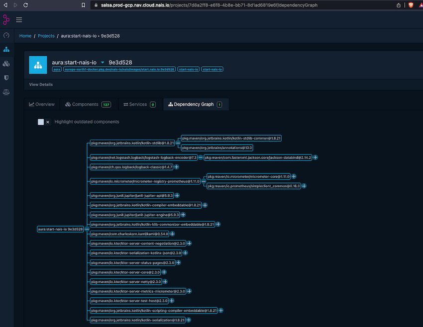

# Salsa

!!! info "Status: Beta"
    This feature is only in a beta.

    **Experimental**: users report that this component is working, but it needs a broader audience to be battle-tested properly.

    Report any issues to the #nais channel on Slack.

## What is SLSA

[SLSA](https://slsa.dev/) is short for _Supply chain Levels for Software Artifacts_ pronounced `salsa`.

It’s a security framework, a check-list of standards and controls to prevent tampering, improve integrity, and secure
packages and infrastructure in our projects.

## SLSA in NAIS

If you use the [nais/docker-build-push](https://github.com/nais/docker-build-push) action to build and push your container image, you will automatically get a signed
attestation/SBOM (Software Bill of Materials) of your container image and its dependencies. The SBOM will be uploaded to your container
registry alongside your image. The attestation is generated by the [Trivy](https://github.com/aquasecurity/trivy-action) github action and signed using [cosign](https://github.com/sigstore/cosign). 

When you deploy your image to NAIS the attestation will be verified by the NAIS platform ([picante](https://github.com/nais/picante)) and uploaded to a SBOM analysis plattform 
called [Dependency-Track](https://dependencytrack.org/). In Dependency-Track you can see the attestation and the vulnerabilities in your image and its dependencies.

### Usage

Simply add [nais/docker-build-push](https://github.com/nais/docker-build-push) to your workflow.

```yaml
          - uses: nais/docker-build-push@v0
            id: docker-push
            with:
              team: myteam # required
              salsa: true # optional, defaults to true
              project_id: ${{ vars.NAIS_MANAGEMENT_PROJECT_ID }} # required, but is defined as an organization variable
              identity_provider: ${{ secrets.NAIS_WORKLOAD_IDENTITY_PROVIDER }} # required, but is defined as an organization secret
            # ... other options removed for readability
              
```

!!! Opt-out
    Opt-out from salsa

    If you want to opt-out from salsa you can set the salsa input to false

    ```yaml
              salsa: false
    ```

See [nais/docker-build-push](https://github.com/nais/docker-build-push) for more options.


### View and analyze dependencies

[Dependency-Track](https://dependencytrack.org/) is deployed to each NAIS cluster (GCP only) and contains attestations and vulnerabilities for all images deployed to the cluster (which have not opted out from salsa).

You can access the Dependency-Track UI at the following URL:

* https://salsa.[clustername].[tenantname].cloud.nais.io

**Example**: [https://salsa.prod-gcp.nav.cloud.nais.io](https://salsa.prod-gcp.nav.cloud.nais.io)

You must login using the **OpenID** button which will redirect you to your organizations identity provider.

Each container in a deployment will have its own project in Dependency-Track. The project name consist of the team name, application name and the container image name.
You can search in projects with the following tags:

 * team
 * application
 * image

Here is a screenshot of a project using the dependency graph in Dependency-Track:



[Dependency-Track](https://dependencytrack.org/) has a ton of features so check out the [documentation](https://docs.dependencytrack.org/) for more information.

### Language support

SBOM generation for different [languages/build tools are dictated by Trivy](https://aquasecurity.github.io/trivy/v0.40/docs/scanner/vulnerability/language/)

#### Known limitations and alternatives

Due to Trivy, you will get a flat graph of dependencies. This is because Trivy does not support Gradle's or Maven dependency resolution.
Trivy parses the .jar files directly and does not have access to the dependency resolution information.
Here is 2 alternatives:

1. Alternative 1 for Gradle users. 

No need to add any plugins to your build file. You will get a deep graph of nested transitive dependencies.

!!! Gradle Action
    Generate a SBOM with the gradle build action.

    ```yaml
        - uses: gradle/gradle-build-action@v2.6.1
          with:
            dependency-graph: generate-and-submit
            arguments: build
    ```

    ```yaml
        -uses: nais/docker-build-push@v0
         with:
           byosbom: dependency-graph-reports/deploy-build.json
    ```

The generated sbom will be located in the ` dependency-graph-reports` directory.

2. Add CycloneDx plugins for a deep graph of nested transitive dependencies for both Gradle and Maven.


!!! Gradle Plugin
    Add the following plugin to your `build.gradle*` file.

    ```groovy
        id("org.cyclonedx.bom") version "1.7.4"
    ```

    In your workflow you can generate a SBOM with the following gradle task command:

    ```yaml
        - name: Generate and output SBOM
          run: ./gradlew cyclonedxBom
    ```

    The SBOM will be default located at `build/reports/bom.json`. Pass the SBOM to the `nais/docker-build-push` action with the following input:

    ```yaml
        uses: nais/docker-build-push@v0
        with:
          byosbom: build/reports/bom.json
    ```
  
    For more info about settings check out the [CycloneDx Gradle Plugin](https://github.com/CycloneDX/cyclonedx-gradle-plugin)

!!! Maven Plugin
    Add the following to your `pom.xml` file.

    ```xml
        <plugins>
            <plugin>
                <groupId>org.cyclonedx</groupId>
                <artifactId>cyclonedx-maven-plugin</artifactId>
                <executions>
                    <execution>
                        <phase>package</phase>
                        <goals>
                            <goal>makeAggregateBom</goal>
                        </goals>
                    </execution>
                </executions>
            </plugin>
        </plugins>
    ```

    In your workflow you can generate a SBOM with the following maven command:

    ```yaml
        - name: Generate and output SBOM
          run: ./mvnw package
    ```

    The SBOM will be default located at `target/bom.json`. Pass the SBOM to the `nais/docker-build-push` action with the following input:

    ```yaml
        uses: nais/docker-build-push@v0
        with:
          byosbom: target/bom.json
    ```
    For more info about settings check out the [CycloneDx Maven Plugin](https://github.com/CycloneDX/cyclonedx-maven-plugin)

#### Use nais/attest-sign directly

When using the `nais/attest-sign` action. You can pass the SBOM to the action with the following input:

```yaml
    uses: nais/attest-sign@v1.x.x
    with:
      sbom: path/to/bom.json
```
