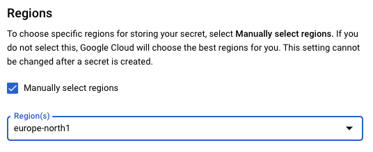
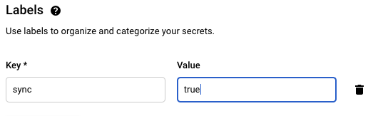
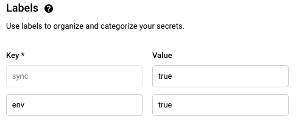

# Google Secrets Manager

!!! warning
    Google Secrets Manager integration with Kubernetes is currently available as an OPEN BETA.
    Please report any issues to the #nais channel on Slack.

You may store secrets in [Google Secrets
Manager](https://cloud.google.com/secret-manager) as an alternative to the
other offered solutions.

## Getting started

Start at the [GCP
Console](https://console.cloud.google.com/security/secret-manager) page and
refer to the [documentation](https://cloud.google.com/secret-manager/docs) for
guides and how-tos on creating and managing secrets.

All secrets must exist in the region `europe-north1`. This option is found when
you click _manually select region_. Unfortunately, we cannot enforce a default
value here.



## Using secrets in applications

Label your secret with `sync=true` to enable synchronization to NAIS. The
latest _secret version_ will be copied into your Kubernetes namespace. This
feature is only available in GCP clusters.



If the secret already existed without this tag, you must create a new _secret
version_ to effectuate the sync.

The name of the secret in Kubernetes will match the name of the secret in
Google Secret Manager. In case of a name collision, the secret will not be
imported.

Modifications to secrets will NOT be synchronized back to Google Secret
Manager, and any modifications might be overwritten at any time.

If your secret contains a list of environment variables:


additionally add the label `env=true`:



The synchronization of secrets into namespaces is managed by the application
[hunter2](https://github.com/nais/hunter2). This application runs in all team
namespaces.

### Example application spec

```
spec:
  filesFrom:
    - secret: my-secret-file
      mountPath: /var/run/secrets/my-secret
      # secret will be available in the file /var/run/secrets/my-secret/secret
  envFrom:
    - secret: my-secret
      # secret will be made available as environment variables
```

### Example secret with environment variables

```
FOO=BAR
BAR=BAZ
```
