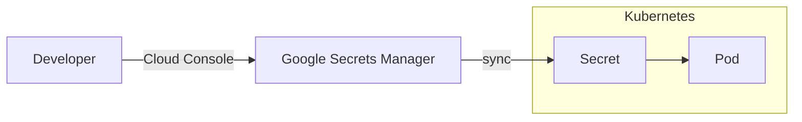
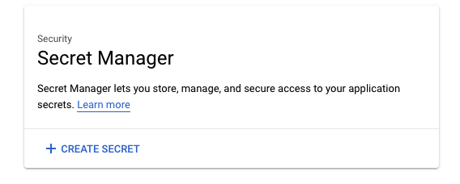
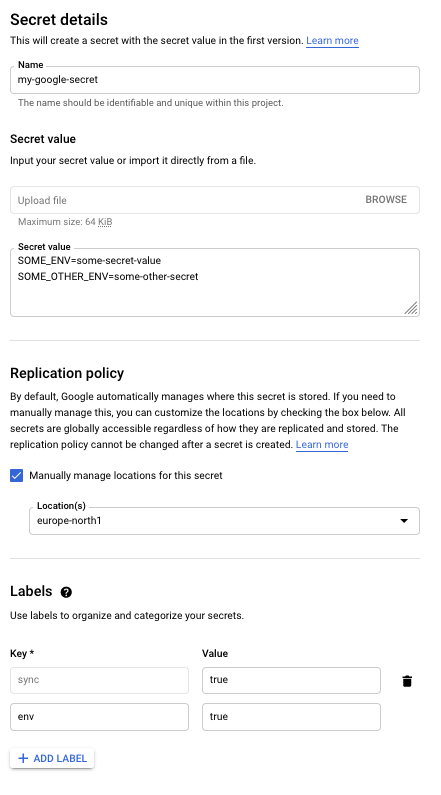

# Google Secrets Manager

[Google Secret Manager][google-secrets-manager] is a managed service for storing secrets in a secure manner. It is a part of the Google Cloud Platform (GCP) and is available to all teams at NAV with applications running on GCP.

This is offered as a supplement to [Kubernetes Secrets](kubernetes-secrets.md), and our Google Secrets Manager implementation uses Kubernetes Secrets to store the actual secrets within the cluster.



[google-secrets-manager]: https://cloud.google.com/secret-manager

## Getting started

!!! tip
    See the [examples](#examples) for a complete illustration of the process.

### Step 1: Create a Secret in Google Secret Manager

???+ check

    Start at the [GCP Console](https://console.cloud.google.com/security/secret-manager) page.

    

    Click on the `Create Secret` button.

    !!! warning "Secret Name Restrictions"
        In order to synchronize the secret to Kubernetes, ensure that the secret name adheres to the following restrictions:

        - Maximum length of 63 characters.
        - May only contain letters, numbers and hyphens (`-`).
        - Must be lowercase.
        - Must start with a lowercase letter or number.
        - Must end with a lowercase letter or number.

    All secrets must exist in the region `europe-north1`.

    This option is found when you click _manually manage locations for this secret_.

    

    Unfortunately, we cannot enforce a default value here.

    Fill in the `Secret value`.

    

### Step 2: Import Secret to Kubernetes

!!! warning "Only available in GCP"
    Importing a secret to Kubernetes is only possible in the [GCP clusters](../../clusters/gcp.md).

!!! warning "One-way Synchronization"
    The secret in Google Secret Manager is the single source of truth.

    Modifications to the secret in Kubernetes will NOT be synchronized back to Google Secret Manager.

    Any modifications done in Kubernetes will be overwritten by the actual secret found in Google Secret Manager.

???+ check

    #### Enable synchronization

    Label your Secret with `sync=true` to enable synchronization to NAIS:

    

    !!! info
        Synchronization only occurs when new _secret versions_ are created.

        If the secret already existed without this label, you must create a new _secret
        version_ to effectuate the sync.

    The latest _secret version_ in Google Secret Manager will be copied into your Kubernetes namespace as a [Kubernetes Secret](kubernetes-secrets.md).

    #### Secret Naming

    The name of the secret in Kubernetes will match the name of the secret in Google Secret Manager.

    !!! warning "Naming collisions"
        If a secret with the same name already exists in Kubernetes, the secret will not be imported.

### Step 2a: Secrets formatted as environment variables

???+ check

    If your secret contains a list of environment variables:

    

    Then additionally add the label `env=true` to your secret in Google Secret Manager:

    ![A screenshot shows how to label your secret, if your secret is formatted as environment variables. The heading is “Labels” and contains a help icon for further explanation. The text is “Use labels to organize and categorize your secrets”. There are two input fields in two rows. You can add rows by using the button “Add row” below, but this is cut from the screenshot so the non-alt-text-users will wonder how it is done. The input field “Key”, in which you should type “sync”. The input field “Value”, in which you should type “true”. For environment variables the second row contains the same input fields, but “Key” should contain “env” and “Value” should contain “true”.](../../assets/google-secret-manager-env-label.png)

    This tells the synchronization mechanism to parse the secret as environment variables.

### Step 3: Using the Kubernetes Secret in your applications

???+ check
    Now that the Secret exists in your Kubernetes namespace, your application may refer to and use it.

    There are two ways of mounting/exposing a Kubernetes Secret to your application:

    - [as files](../../nais-application/application.md#filesfromsecret), or
    - [as environment variables](../../nais-application/application.md#envfromsecret)

    #### Files

    ```yaml
    spec:
      # secret will be available in the file named "secret"
      # in the directory /var/run/secrets/my-secret/
      filesFrom:
        - secret: my-google-secret # value is the secret name in Google Secret Manager
          mountPath: /var/run/secrets/my-secret
    ```

    #### Environment variables

    ```yaml
    spec:
      # secret will be made available as environment variables
      envFrom:
        - secret: my-google-secret # value is the secret name in Google Secret Manager
    ```

### Automatic Reload

The Kubernetes secret will automatically have the `reloader.stakater.com/match: "true"` annotation set.

If the value of the secret is changed or updated, any application that refers to this secret will be
[automatically restarted](../../nais-application/config-reloading.md) to load the new values.

## Examples

### Example secret with single value format

This method is generally used when you need a binary file as a secret mounted to the file system of your pod.
If you need environment variables, see the [other example](#example-with-environment-variable-format).

??? example "Secret in Google Secret Manager (click to expand)"

    ![A screenshot shows the entire form for “Secret details”, using the example of single value format. It consists of the following sections: The heading is “Secret details” followed by an input field for “Name”, a section for “Secret value” where you can upload or enter your secret value. A section for “Replication policy”, where you should select “Manually manage locations for the secret” using the checkbox. In the dropdown below, called “Location(s)”, select “europe-north1”. The section below is called “Labels” and allows you to add labels to organize and categorize your secrets, using input fields for “Key” and “Value”. Below the row is a button “Add label”. Add a label, and in the new input field “Key” enter “env”. In the following input field “Value” enter “true”](../../assets/google-secret-manager-example-single-value.png)

??? example "Imported Secret in Kubernetes (click to expand)"

    ```yaml
    apiVersion: v1
    data:
      secret: c29tZS1zZWNyZXQtdmFsdWU=
      # key="secret"
      # value="some-secret-value", base64 encoded
    kind: Secret
    metadata:
      annotations:
        hunter2.nais.io/last-modified: "2021-03-25T08:04:19Z"
        hunter2.nais.io/last-modified-by: user@nav.no
        hunter2.nais.io/secret-version: "1"
        reloader.stakater.com/match: "true"
      creationTimestamp: "2021-03-25T08:04:25Z"
      labels:
        nais.io/created-by: hunter2
      name: my-google-secret
      namespace: my-team
    type: Opaque
    ```

??? example "Secret values when mounted to application (click to expand)"

    ```yaml
    spec:
      # secret will be available in the file named "secret" in the directory /var/run/secrets/my-google-secret/
      # e.g. /var/run/secrets/my-google-secret/secret
      # note that the name "secret" is hard-coded and not configurable; the key used in the example below _must_ be "secret".
      filesFrom:
        - secret: my-google-secret # value is the secret name in Google Secret Manager
          mountPath: /var/run/secrets/my-google-secret
    ```

### Example with environment variable format

??? example "Secret in Google Secret Manager (click to expand)"

    

??? example "Imported Secret in Kubernetes (click to expand)"

    ```yaml
    apiVersion: v1
    data:
      SOME_ENV: c29tZS1zZWNyZXQtdmFsdWU=
      # key="SOME_ENV"
      # value="some-secret-value", base64 encoded
      SOME_OTHER_ENV: c29tZS1vdGhlci1zZWNyZXQ=
      # key="SOME_OTHER_ENV"
      # value="some-other-secret", base64 encoded
    kind: Secret
    metadata:
      annotations:
        hunter2.nais.io/last-modified: "2021-03-25T08:24:58Z"
        hunter2.nais.io/last-modified-by: user@nav.no
        hunter2.nais.io/secret-version: "2"
        reloader.stakater.com/match: "true"
      creationTimestamp: "2021-03-25T08:04:25Z"
      labels:
        nais.io/created-by: hunter2
      name: my-google-secret
      namespace: my-team
    type: Opaque
    ```

??? example "Secret values when mounted to application (click to expand)"

    ```yaml
    spec:
      # secret will be available as files in the directory /var/run/secrets/my-google-secret/
      # e.g. /var/run/secrets/my-google-secret/SOME_ENV and /var/run/secrets/my-google-secret/SOME_OTHER_ENV
      filesFrom:
        - secret: my-google-secret # value is the secret name in Google Secret Manager
          mountPath: /var/run/secrets/my-google-secret

      # secret will be made available as environment variables
      # SOME_ENV=some-secret-value
      # SOME_OTHER_ENV=some-other-secret
      envFrom:
        - secret: my-google-secret # value is the secret name in Google Secret Manager
    ```
