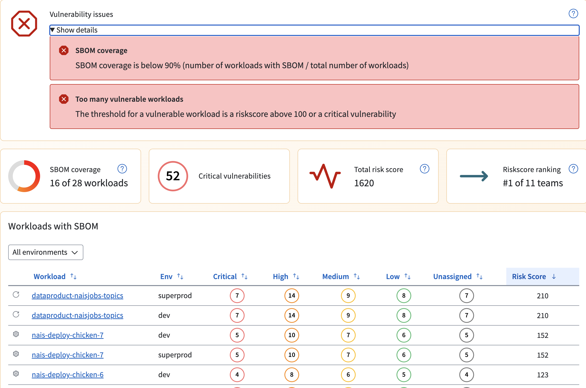

# Vulnerability insights in Nais Console 

Teams can visit the Console to view their workload vulnerabilities, for example:

https://console.[tenant].cloud.nais.io/team/[team]/vulnerabilities

In the Console vulnerability overview, you can sort vulnerabilities by severity and cluster to get a better overview of the vulnerabilities in your workloads.

You will get the status of the teams' total, like coverage, total critical or risk score ranking. 

