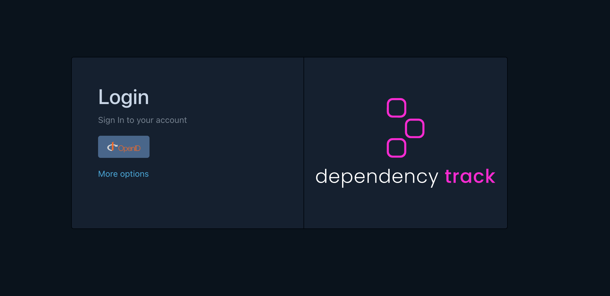

# Explore DependencyTrack

You can access the DependencyTrack user interface through the following URL:

https://salsa.[tenant].cloud.nais.io

To sign in, click the OpenID button, which will redirect you to your organization's identity provider.

In DependencyTrack, each image in a deployment or job is linked to its own project.
A project can be associated with multiple workloads, teams, and clusters.
The project name is based on the image name. For Google Artifact Registry (GAR),
the project name follows this format: `europe-north1-docker.pkg.dev/nais-management-233d/[team]/[application]`,
with the image version set as the project version.

You can list projects your interested in using the following tag prefixes:

* `team:`
* `workload:`
* `image:`

Below is a screenshot of a project using the dependency graph within DependencyTrack:

[DependencyTrack](https://dependencytrack.org/) has a ton of features so check out
the [documentation](https://docs.dependencytrack.org/) for more information.

## Language support

SBOM generation for
different [languages/build tools dictated by Trivy](https://aquasecurity.github.io/trivy/v0.56/docs/scanner/vulnerability/#supported-languages).