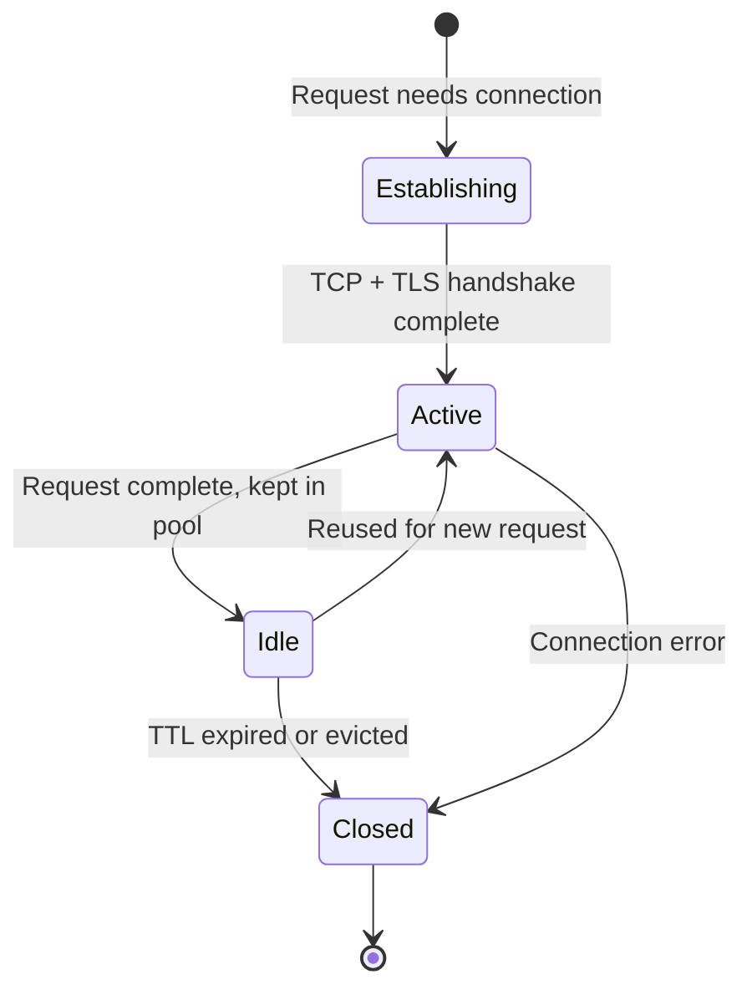

# HTTP client connection management

This page explains how HTTP client connection management works, including connection pooling, timeouts, and how network infrastructure affects your application's reliability.

## Why connection management matters

Modern applications make hundreds or thousands of HTTP requests. Opening a new TCP connection for each request is expensive:

- **TCP handshake overhead**: Three-way handshake (SYN, SYN-ACK, ACK) adds latency
- **TLS handshake**: Additional round trips for certificate exchange and key agreement
- **Slow start**: TCP congestion control starts with small windows
- **Resource consumption**: Each new connection consumes system resources

HTTP connection pooling solves this by reusing established connections, dramatically improving performance and reducing load.

## How connection pooling works

### Connection lifecycle



When no pooled connection is available, the client performs DNS lookup, establishes TCP connection, negotiates TLS (if HTTPS), then sends the request. After the response completes, the connection returns to the pool instead of closing. The next request to the same host reuses this connection, bypassing all handshake overhead.

Connections are removed from the pool when: TTL expires, idle timeout reached, background eviction runs, connection error detected, or pool size limit exceeded.

### HTTP Keep-Alive

Connection pooling relies on HTTP Keep-Alive:

```http
Connection: keep-alive
Keep-Alive: timeout=60, max=100
```

This signals that the connection should remain open after the response completes. Both client and server must support it.

## DNS and connection failures

DNS plays a critical role in connection establishment and can be a source of intermittent failures.

### DNS caching issues

**Stale DNS cache:** When service IPs change (pod rotation, deployment), cached DNS entries point to old IPs, causing connection failures until TTL expires.

**Key considerations:**

- Services on Nais have short DNS TTL (30 seconds)
- Client-side DNS cache may not respect TTL
- JVM caches DNS indefinitely by default (set `networkaddress.cache.ttl`)
- Connection pools may hold connections to old IPs

### DNS failures

DNS resolution can fail due to server overload, network partitions, or rate limiting, causing "Unknown host" errors even when services are healthy.

**Mitigation:**

- Set connection TTL to 5-10 minutes for periodic DNS re-resolution
- Implement retry logic for DNS failures
- Connection pooling reduces DNS lookup frequency

## Understanding timeout types

Different timeout settings control different aspects of connection behavior. Configuring them correctly is critical for reliability.

### Connection timeout

**What it controls:** Maximum time to wait for the initial TCP connection to establish.

**Common names:**

- `connectTimeout` (most libraries)
- `CONNECT_TIMEOUT_MILLIS` (Netty)
- Connection timeout (Apache HttpClient)

**Typical values:** 5-10 seconds

**What happens when exceeded:** Connection attempt fails immediately with a timeout exception.

**When to adjust:**

- Cross-cluster or cross-datacenter calls with high latency
- Calls through multiple proxies
- Networks with packet loss

### Socket/idle timeout

**What it controls:** Maximum time a connection can remain idle in the pool before being removed.

**Common names:**

- `timeout` (Node.js Agent)
- `connectionTimeToLive` (Apache HttpClient)
- `maxIdleTime` (Reactor Netty)
- `keepAliveTime` (Ktor)

**Typical values:** Based on infrastructure timeout constraints (e.g., 55 minutes for on-prem firewall timeouts)

**What happens when exceeded:** Connection is closed and removed from pool.

**Why it matters:** Prevents attempting to reuse connections that network infrastructure has already dropped.

### Read/response timeout

**What it controls:** Maximum time to wait for the complete response after sending a request.

**Common names:**

- `responseTimeout` (Reactor Netty)
- `requestTimeout` (Ktor)
- `timeout` (Axios - request-level)
- Read timeout (Apache HttpClient)

**Typical values:** 10-60 seconds, depending on endpoint characteristics

**What happens when exceeded:** Request is cancelled with a timeout exception.

**When to adjust:**

- Long-running operations (batch processing, report generation)
- Large file downloads
- Streaming responses

### Background eviction

**What it controls:** Periodic cleanup of idle or stale connections from the pool.

**Common names:**

- `evictIdleConnections` (Apache HttpClient)
- `evictInBackground` (Reactor Netty)

**Typical values:** Every 5 minutes

**Why it matters:** Removes connections that may have been silently dropped by network infrastructure between requests, preventing errors on the next request.

## How network infrastructure affects connections

### Stateful firewalls

Firewalls maintain connection state tables and drop idle connections to prevent exhaustion. Most firewalls drop connections **silently** without TCP FIN or RST packets - connections appear healthy in the pool until you try to reuse them.

**Solution:** Configure connection TTL below firewall timeout threshold.

### Load balancers and NAT gateways

Load balancers and NAT gateways enforce their own idle timeouts (typically 60-600 seconds).

**Key points:**

- Client connection TTL should be less than load balancer timeout
- Keep-alive probes may not prevent timeouts
- Backend service connections have separate timeouts
- NAT timeout shorter than client TTL means silent connection drops

### Proxies

Forward and reverse proxies add another layer of timeout configuration:

- **Proxy → Backend timeout**: How long proxy waits for backend response
- **Client → Proxy timeout**: How long client waits for proxy response
- **Proxy connection pooling**: Proxy may maintain separate connection pool to backends

## Connection pool sizing

### Maximum connections

**Per-route/per-host limits:**

Prevents overwhelming a single backend service:

```java
cm.setDefaultMaxPerRoute(20);  // Max 20 concurrent connections per host
```

**Total pool size:**

Limits total connections across all hosts:

```java
cm.setMaxTotal(200);  // Max 200 connections total
```

### Pool exhaustion

When all connections are in use, new requests must:

- Wait for a connection to become available
- Timeout if wait exceeds configured limit
- Potentially fail with "Connection pool exhausted"

**Symptoms:**

- Requests fail even though backend is healthy
- High request latencies during traffic spikes
- "NoHttpResponseException" or similar errors

**Solutions:**

- Increase pool size if resources allow
- Reduce response timeout to fail faster
- Add circuit breaker to prevent cascade failures
- Scale application horizontally

## Common configuration mistakes

### Infinite or too-long connection TTL

**Problem:** Connections never expire or expire after infrastructure drops them.

**Symptoms:** Intermittent "Connection reset" or "Unexpected end of stream" errors, especially after idle periods.

**Solution:** Set connection TTL below infrastructure timeout thresholds (e.g., 55 minutes for 60-minute firewall timeout).

### No background eviction

**Problem:** Dead connections remain in pool until used.

**Symptoms:** First request after idle period fails, subsequent retry succeeds.

**Solution:** Enable background eviction (e.g., every 5 minutes).

### Confusing request timeout with connection TTL

**Problem:** Setting very short request timeout thinking it will refresh connections.

**Symptoms:**

- Legitimate long-running requests fail
- Unnecessary request failures and retries

**Solution:** Use connection TTL for pool management, request timeout for detecting hung requests.

## Nais platform considerations

### Pod lifecycle and connection pools

On Nais, when your application pods are terminated (during deployments, scaling, or node maintenance):

1. Pod receives SIGTERM signal
2. Pod enters "Terminating" state
3. Endpoints removed from Service (eventual consistency)
4. Grace period allows in-flight requests to complete (default 30s)

**Implications for connection pools:**

- Your application may have pooled connections to terminating pods of other services
- Requests to terminating pods may fail if grace period expires
- Need proper retry logic for pod rotation scenarios

**Best practices on Nais:**

- Implement graceful shutdown in your application
- Configure preStop hooks to delay shutdown
- Use readiness probes to stop traffic before shutdown
- Implement client-side retry with exponential backoff

### Cross-cluster and cross-datacenter calls

Higher network latency affects timeout tuning:

**Same cluster:**

- Connection timeout: 5-10 seconds
- Read timeout: 10-30 seconds

**Cross-cluster or cross-datacenter:**

- Connection timeout: 10-15 seconds
- Read timeout: 30-60 seconds

Also consider:

- Retry budget (avoid retry storms)
- Circuit breaker thresholds
- Hedged requests for latency-sensitive calls

## Related resources


- [Communicate reliably between GCP and on-prem](../how-to/gcp-fss-communication.md) - Practical configuration for on-premises firewall timeouts

- [Access policies](../how-to/access-policies.md) - Configure network access between services
- [Good practices](good-practices.md) - Application development best practices
