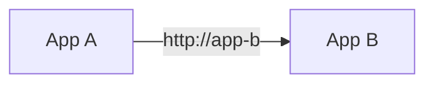
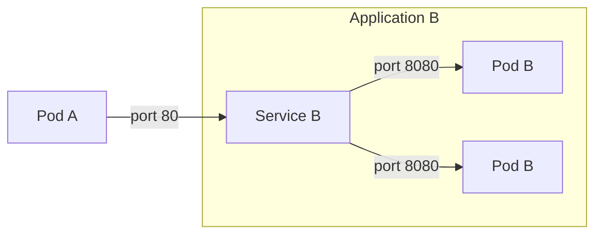

# Service Discovery

Applications deployed to Kubernetes are exposed through what is known as a [:octicons-link-external-16:`Service`][k8s-service-discovery].
This is an internal address that allows for direct communication within a [Kubernetes cluster](environment.md) without having to go through an external ingress, load balancer, or proxy.

This is the recommended way to communicate between applications in the same Kubernetes cluster. This avoids having to [expose your application to the outside world](../application/how-to/expose.md), and allows for direct communication between applications.

A `Service` in Kubernetes has some interesting properties:

1. It provides a single, stable address for a set of pods. This means that if a pod dies, moves or is upgraded, the `Service` will continue to point to the remaining pods.
2. It can load balance traffic across multiple pods. This is useful for scaling out your application without having to change the address of the `Service` or update clients consuming your application.
3. Translates between ports. This is useful if you want to expose a service on a different port than the one your application is listening on. For example, you can expose port `80` on the `Service` and have it forward to port `8080` on the pod.

Services available can be viewed with `kubectl get service` in a particular namespace. The service name for a [NAIS Application](../application/README.md) is the same as the Application name (`metdata.name`) and is the same across any cluster where the Application is deployed. This allows for simpler configuration.

[k8s-service-discovery]: https://kubernetes.io/docs/concepts/services-networking/service/

## Related pages

:dart: Learn how to [use service discovery to communicate with other workloads](../how-to/communication.md).

:dart: Learn how to [set up access policies for your workloads](../how-to/access-policies.md).
