# Zero Trust

Nais embraces the [zero trust](https://en.wikipedia.org/wiki/Zero_trust_security_model) security model, where the core principle is to "never trust, always verify".

In Nais, every [workload](../README.md) is isolated by default.
Workloads are not able to make _any_ outbound requests or receive _any_ incoming traffic unless explicitly allowed.

We use _access policies_ to specify which applications and external addresses a workload can communicate with.
This is done by defining _inbound_ and _outbound_ policies in the workload's manifest.

## Inbound traffic

Allowing inbound access to your application depends on your consumers and the [environment](../explanations/environment.md) they're in:

```mermaid
graph TD
  A[Are your consumers in the same environment?]
  A --> |Yes| B[Are they in the same namespace?]
  A --> |No| Ingress[🎯 <a href='../../application/how-to/expose'>Expose through ingress</a>]
  B --> |Yes| InternalSameNS[🎯 <a href='../../how-to/access-policies#receive-requests-from-workloads-in-the-same-namespace'>Allow access in same namespace</a>]
  B --> |No| InternalOtherNS[🎯 <a href='../../how-to/access-policies#receive-requests-from-workloads-in-other-namespaces'>Allow access from other namespaces</a>]
```



### Service discovery

Consumers running in the same environment should prefer to communicate with your workload via [service discovery](../application/explanations/expose.md#service-discovery).

[`.spec.accessPolicy.inbound`](../application/reference/application-spec.md#accesspolicyinbound) controls inbound network traffic via service discovery.

### Ingress

To allow consumers in other environments to communicate with your workload, you should expose it with an [ingress](../application/explanations/expose.md#ingress).
The ingress domain controls which networks the ingress is reachable from. Other than that, inbound network traffic through an ingress is essentially unrestricted.

[`.spec.accessPolicy.inbound`](../application/reference/application-spec.md#accesspolicyinbound) **does not** control network traffic via ingresses.

## Outbound traffic

Allowing outbound traffic from your application depends on whether you're using [service discovery](../application/explanations/expose.md#service-discovery) or external addresses:


Services offered by Nais (such as [databases](../../persistence/postgres/README.md)) are automatically configured with necessary outbound access policies.

### Service discovery

If the service you want to call is in the same environment, you should communicate with it by using service discovery.

[`.spec.accessPolicy.outbound.rules`](../application/reference/application-spec.md#accesspolicyoutboundrules) controls outbound network traffic via service discovery.

### External addresses

An external address is any address outside the environment your workload is running in.
[Ingresses](../application/explanations/expose.md#ingress) exposed by other workloads are also considered external addresses.

[`.spec.accessPolicy.outbound.external`](../application/reference/application-spec.md#accesspolicyoutboundexternal) controls which external addresses your workload can communicate with.

## Example

Consider two applications: a frontend and a backend.
The frontend needs to communicate with the backend by using service discovery.

This communication is denied by default as indicated by the red arrow.


To fix this, the frontend needs to allow outbound traffic to the backend by adding the following access policy:

```yaml
spec:
  accessPolicy:
    outbound:
      rules:
        - application: backend
```


However, the frontend is still not allowed to make any requests to the backend.
The missing piece of the puzzle is an inbound policy, allowing the frontend to communicate with it:

```yaml
spec:
  accessPolicy:
    inbound:
      rules:
        - application: frontend
```


Now that both applications have explicitly declared their respective inbound and outbound policies, communication is allowed.

## Related pages

:dart: Learn [how to define access policies](../how-to/access-policies.md)

:dart: Learn [how to communicate with other workloads via service discovery](../how-to/communication.md)
