```mermaid
graph TD
  A[Are your consumers in the same environment?]
  A --> |Yes| B[Are they in the same namespace?]
  A --> |No| Ingress[🎯 <a href='../../application/how-to/expose'>Expose through ingress</a>]
  B --> |Yes| InternalSameNS[🎯 <a href='../../how-to/access-policies#receive-requests-from-workloads-in-the-same-namespace'>Allow access in same namespace</a>]
  B --> |No| InternalOtherNS[🎯 <a href='../../how-to/access-policies#receive-requests-from-workloads-in-other-namespaces'>Allow access from other namespaces</a>]
```

# Zero Trust

NAIS embraces the [zero trust](https://en.wikipedia.org/wiki/Zero_trust_security_model) security model, where the core principle is to "never trust, always verify".

In NAIS, every [workload](../README.md) is isolated by default. This means that workloads are not able to make _any_ outbound requests or receive _any_ incoming traffic unless explicitly allowed.

We use _access policies_ to specify which applications and services a workload can communicate with.
This is done by defining _inbound_ and _outbound_ policies in the workload's manifest.


Access policies only restrict network traffic for workloads running in the [GCP environments](../reference/environments.md). They do not affect network traffic in the on-premise environments.


## Inbound traffic

Depending on your use case and [environment](../reference/environments.md), you can allow inbound access in multiple ways:



Inbound policies defined in [`.spec.accessPolicy.inbound`](../application/reference/application-spec.md#accesspolicyinbound) are:

- enforced for _consumers in the same environment_ using [service discovery](service-discovery.md).
- **not** enforced for traffic through an [ingress](../reference/ingress.md).

- enforced for authorizing consumers using [Entra ID](../../auth/entra-id/README.md) or [TokenX](../../auth/tokenx/README.md) regardless of environment.


**Inbound policies do not affect ingress traffic**.
An ingress exposes your application to a selected audience, depending on the domain.
All traffic through an ingress is implicitly allowed.
Your workload is thus responsible for authorizing requests if exposed through an ingress.

## Outbound traffic

Outbound traffic can be allowed to either _other workloads in the same environment_ as well as _external addresses_:


Outbound policies defined in [`.spec.accessPolicy.outbound`](../application/reference/application-spec.md#accesspolicyoutbound) are:

- enforced when _consuming other workloads in the same environment_ through [service discovery](service-discovery.md) ([`.spec.accessPolicy.outbound.rules`](../application/reference/application-spec.md#accesspolicyoutboundrules)).
- enforced for all traffic to external addresses ([`.spec.accessPolicy.outbound.external`](../application/reference/application-spec.md#accesspolicyoutboundexternal)).

**Ingresses are external addresses**.
We recommend using [service discovery](../how-to/communication.md) to communicate with other workloads when possible.

Services offered by NAIS (such as [databases](../../persistence/postgres/README.md)) are automatically configured with necessary access policies.

## Example

Consider a simple application which consists of a frontend and a backend, where naturally the frontend needs to communicate with the backend.

This communication is denied by default as indicated by the red arrow.


In order to fix this, the frontend needs to allow outbound traffic to the backend by adding the following access policy.

```yaml
spec:
  accessPolicy:
    outbound:
      - application: backend
```


However - the frontend is still not allowed to make any requests to the backend.
The missing piece of the puzzle is adding an inbound policy to the backend like so:

```yaml
spec:
  accessPolicy:
    inbound:
      - application: frontend
```


Now that both applications has explicitly declared their policies, the communication is allowed.

## Related pages

:dart: Learn [how to define access policies](../how-to/access-policies.md)

:dart: Learn [how to communicate with other workloads within an environment](../how-to/communication.md)
