```mermaid
graph TD
  A[Are your consumers in the same environment?]
  A --> |Yes| B[Are they in the same namespace?]
  A --> |No| Ingress[🎯 <a href='../../application/how-to/expose'>Expose through ingress</a>]
  B --> |Yes| InternalSameNS[🎯 <a href='../../how-to/access-policies#receive-requests-from-workloads-in-the-same-namespace'>Allow access in same namespace</a>]
  B --> |No| InternalOtherNS[🎯 <a href='../../how-to/access-policies#receive-requests-from-workloads-in-other-namespaces'>Allow access from other namespaces</a>]
```

# Zero Trust

NAIS embraces the [zero trust](https://en.wikipedia.org/wiki/Zero_trust_security_model) security model, where the core principle is to "never trust, always verify".

In NAIS every [workload](../README.md) is isolated by default - which means that it is not able to make _any_ outbound requests or receive _any_ incoming traffic unless explicitly allowed. 

## Inbound traffic

Depending on your use case and [environment](../reference/environments.md), you can allow inbound access in multiple ways:



If you define an [ingress](../reference/ingress.md), your application will be available to a given audience based on the domain.
**Access policies have no effect on ingress traffic**. This means that all traffic through an ingress is implicitly allowed.
Your workload is thus responsible for verifying requests if exposed through an ingress.

## Outbound traffic

For outbound traffic, you can allow access to other workloads in the same environment, or to external endpoints:

```mermaid
graph TD
  A[Is the service you want to call in the same environment?]
  A --> |Yes| B[Are they in the same namespace?]
  A --> |No| Internet[🎯 <a href='../../how-to/access-policies#send-requests-to-external-endpoints'>Allow access to external endpoint</a>]
  B --> |Yes| InternalSameNS[🎯 <a href='../../how-to/access-policies#send-requests-to-another-app-in-the-same-namespace'>Allow access to same namespace</a>]
  B --> |No| InternalOtherNS[🎯 <a href='../../how-to/access-policies#send-requests-to-other-app-in-another-namespace'>Allow access to other namespaces</a>]
```



For the native NAIS services - the platform takes care of this for you. For example, when you have a [database](../../persistence/postgres/README.md), the access policies required to reach the database will be created automatically.

## Example

Consider a simple application which consists of a frontend and a backend, where naturally the frontend needs to communicate with the backend.

This communication is denied by default as indicated by the red arrow.


In order to fix this, the frontend needs to allow outbound traffic to the backend by adding the following access policy.

```yaml
spec:
  accessPolicy:
    outbound:
      - application: backend
```


However - the frontend is still not allowed to make any requests to the backend.
The missing piece of the puzzle is adding an inbound policy to the backend like so:

```yaml
spec:
  accessPolicy:
    inbound:
      - application: frontend
```


Now that both applications has explicitly declared their policies, the communication is allowed.

See more about [how to define access policies](../how-to/access-policies.md)
