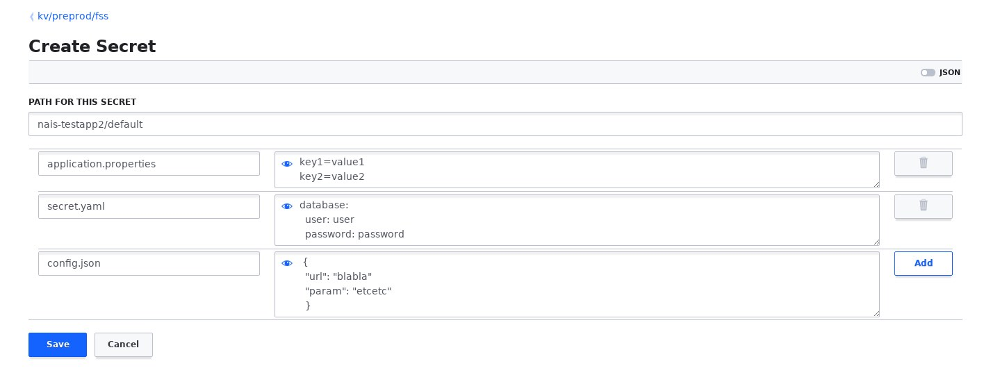

 Vault
=======

Vault by Hashicorp is a tool for managing secrets. 
To make use of Vault as a secret backend you need to:

1. Give your application access to Vault.
2. Give yourself or your team access to Vault.
3. Provide the the secrets for your application to consume.
4. Enable Vault integration in your NAIS manifest config. 

The first three requirements are covered by a pull request to the following repo: [vault-iac](https://github.com/navikt/vault-iac/tree/master/terraform)
Enabling Vault integration in a NAIS application is covered below.

## NAIS manifest config

```
secrets: false #Optional. If set to true fetch secrets from Vault and inject the secrets into the pods
```

This is best illustrated using an example

Given the following secrets in Vault:



The application ***nais-testapp2*** when deployed to the ***preprod-fss cluster*** and namespace ***default*** will get the secrets injected as files with ***key*** as filename and ***value*** as file content.  Please note that file content is a free format defined as per your applications need, e.g. its content can be `json`, `yaml`, or even plain text `properties`.  

```
/var/run/secrets/nais.io/vault

 # ls -lt /var/run/secrets/nais.io/vault/
total 8
-rw-r--r--    1 root     root            27 Sep 19 12:19 application.properties
-rw-r--r--    1 root     root            43 Sep 19 12:19 secret.yaml
-rw-r--r--    1 root     root            43 Sep 19 12:19 config.json

~ # cat /var/run/secrets/nais.io/vault/application.properties 
key1: value1
key2: value2

~ # cat /var/run/secrets/nais.io/vault/secret.yaml 
database:
  user: user
  password: password

~ # cat /var/run/secrets/nais.io/vault/config.json 
  {
  "url": "blabla"
  "param": "etcetc"
  }

```


