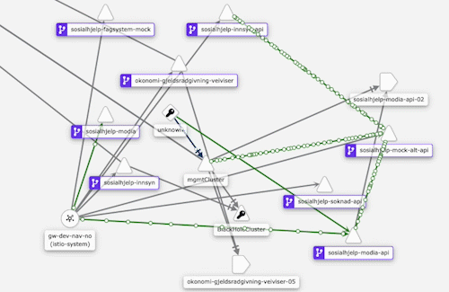
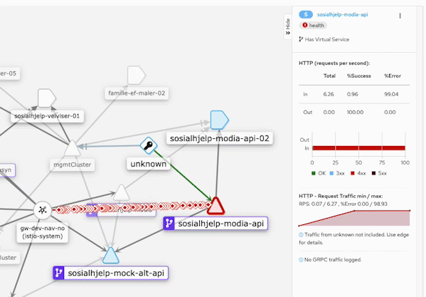
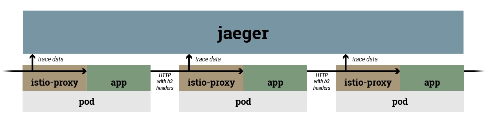
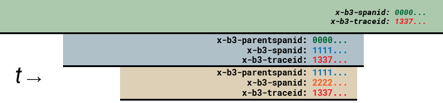

# Distributed tracing

With program flow distributed across many microservices, the ability to observe the different services in context can become a valuable tool for development and operations. 

The simplest way to get an overview is to observe the Istio service mesh using Kiali. If there is a need to observe the causal relationship among individual calls to services, [envoy-based tracing](#envoy-based-context-extraction) is required.

## Visualizing service mesh with Kiali

NAIS leverages the Istio service mesh and Kiali dashboard to give developers a visualization of the service mesh and its general health, with no code modifications required.
Kiali can be reached at kiali.*cluster-name*.nais.io, eg. [kiali.dev-gcp.nais.io](https://kiali.dev-gcp.nais.io).



Kiali will also give a quick graphical overview of failing HTTP calls.



## Envoy-based context extraction

Kiali offers a nice view of statistics. However, it is not possible to say that request A is a consequence of request B without adding additional context. Istio supports transparently reading special tracing headers from HTTP requests, and submitting trace data to jaeger.



This allows you to get up and running quickly with distributed tracing with relatively minimal changes needed to your code. All you need to do is copy the [appropriate headers](#trace-headers) from incoming requests to any outgoing it may cause, and istio-proxy and Jaeger does the rest for you.

Loading a React page which issues hundreds of API calls generates a trace like this:


If envoy-based tracing covers your needs, this is the recommended approach to tracing. 
But the approach does have some limitations; if you need to attach debug context or to create spans even inside a single node process, see [Direct submission](#direct-submission).

### NAIS configuration

To enable envoy-based tracing, add the following stanza to nais.yaml under "spec":

```
apiVersion: "nais.io/v1alpha1"
kind: "Application"
spec:
  ...
  tracing:
    enabled: true
```

When this is enabled, the following changes occur to your deployment:
* A network policy is enabled which allows egress to the Jaeger app services
* The istio-proxy sidecar is configured to sample 100% of incoming requests

This will have the effect that any incoming requests to your application will generate a trace to Jaeger. These traces can be viewed in tracing.*cluster-name*.nais.io, eg [tracing.dev-gcp.nais.io](https://tracing.dev-gcp.nais.io/).

### Trace headers

To give Jaeger sufficient context to reconstruct a trace, the application must read a set of HTTP headers from the incoming request and forward them to any requests further down the chain.

*See also [Istio's documentation](https://istio.io/latest/faq/distributed-tracing/#how-to-support-tracing)*

The following trace headers must be forwarded as they are received:

* `x-b3-traceid`
* `x-b3-spanid`
* `x-b3-parentspanid`
* `x-b3-sampled`
* `x-b3-flags`
* `x-b3`



**TODO: Check source code to find which headers are actually dealt with by istio-proxy**

**TODO: Figure out semantics of the sampled/flags headers** 

### Code examples

Tracing was initially deployed in NAIS in collaboration with team digisos, who used envoy-based tracing to identify an intermittent problem causing spikes in page render time. 
The examples below are therefore examples, not references.
Readers who find more elegant solutions are encouraged to submit pull requests to this documentation.

#### React

The following code generates a 128-byte UUID, which is split into two 64-bit identifiers. These identifiers are then passed along with API requests. This creates a trace which spans an entire page session.

**TODO: Clarify jaeger's requirements for identifier; documentation is unclear/contradictory**

```
// In the file top level
import { v4 as uuidv4 } from 'uuid';
const sessionTraceID = uuidv4().toString().replaceAll('-','');

        // Inside the request method
        headers.append('X-B3-TraceId', sessionTraceID.substr(0, 16));
        headers.append('X-B3-SpanId', sessionTraceID.substr(16, 16));
```

## Direct submission

The user may send tracing data to jaeger via [a plethora of supported protocols](https://www.jaegertracing.io/docs/1.20/apis/), including OpenTracing, Thrift and Zipkin.
A [robust ecosystem of libraries](https://www.jaegertracing.io/docs/1.20/client-libraries/) exist for several languages.

This mode of using Jaeger is not currently supported by NAIS, but if there is a need, it would be easy to implement.
This is largely mentioned here to see if there is any demand.
If there is, please contact Tore Sinding Bekkedal.