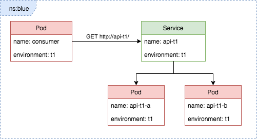
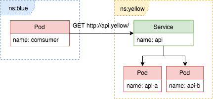

# Service Discovery [Future, not current state]
There is one namespace per team, where every application belonging to that team resides.
Within the same namespace all applications are accessible through their names, i.e. a rest api named 'api' can be
accessed from other applications in the same namespace by `http://api/`

## Multiple environments
If you need multiple different versions of your application running at the same time, you can specify `environment` in deployment request
like this:

<pre><code>
{
  "application": "api",          // application name
  "version": "2",                // version of your application
  "zone": "sbs",                 // what zone your application runs in
  <b>"environment": "t1"</b>,           // optional: defaults to 'default'
  "fasitEnvironment": "t1",      // fasit environment
  "fasitUsername": "brukernavn", // fasit username
  "fasitPassword": "passord",    // fasit password
  "manifesturl": "https://..."   // optional: defaults to using internal nexus with groupid=nais, artifactid=<appname>, version=<version>, type=yaml
}
</code></pre>

To communicate with this instance you'd have to use `http://api-t1/`

## Crossing the team boundary
In order to communicate with applications owned by other teams, you have to postfix the url with `.teamName` for service discovery to work
(i.e. `http://api.teamName/` or `http://api-t1.teamName`)

## Making the same code work in multiple environments
As urls now may or may not contain environment we suggest you include som logic in your code to avoid making code changes for every
environment your application runs in. The current environment an application is running in is injected at deploytime as the environment
variable `APP_ENVIRONMENT` which can be used to construct urls.

### Python example:
<pre><code class="lang-python">def assemble_url(application, env=os.environ['APP_ENVIRONMENT'], team=None):
  url = application
  if env and env is not "default":
    url += "-" + env
  if team:
    url += "." + team

  return url

# Running in <b>t1</b> would yield:
>>> assemble_url('api')
'api-t1'
>>> assemble_url('api', team='team')
'api-t1.team'

# Running in <b>default</b> would yield:
>>> assemble_url('api')
'api'
>>> assemble_url('api', team='team')
'api.team'</code></pre>
