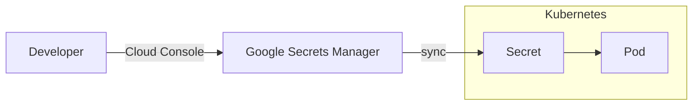

# Google Secrets Manager

[Google Secret Manager][google-secrets-manager] is a managed service for storing secrets in a secure manner. It is a part of the Google Cloud Platform (GCP) and is available to all teams at NAV with applications running on GCP.

This is offered as a supplement to [Kubernetes Secrets](kubernetes-secrets.md), and our Google Secrets Manager implementation uses Kubernetes Secrets to store the actual secrets within the cluster.



The secret in Google Secret Manager is the single source of truth.
Modifications to the secret in Kubernetes will **not** be synchronized back to Google Secret Manager.
Any modifications done in Kubernetes will be overwritten by the actual secret found in Google Secret Manager.

[google-secrets-manager]: https://cloud.google.com/secret-manager

## How-To

!!! tip
    See the [examples](#examples) for a complete illustration of the process.

### Step 1: Create a Secret in Google Secret Manager

Start at the [GCP Console](https://console.cloud.google.com/security/secret-manager) page.


Click on the `Create Secret` button.

### Step 2: Secret Name

Give your secret a name. Ensure that the secret name adheres to the following restrictions:

- Maximum length of 63 characters.
- May only contain letters, numbers and hyphens (`-`).
- Must be lowercase.
- Must start with a lowercase letter or number.
- Must end with a lowercase letter or number.

The name of the secret in Kubernetes will match the name of the secret in Google Secret Manager.

!!! warning "Naming collisions"
    Make sure that the secret name does not collide with an existing secret name.
    
    If a secret with the same name already exists in Kubernetes, the secret will **not** be imported.

### Step 3: Secret Replication Policy

All secrets must exist in the region `europe-north1`. This option is found when you click _manually manage locations for this secret_.


### Step 4: Secret Value

Fill in the `Secret value`.


If your secret contains environment variables (i.e. in the `.env` format with key-value pairs separated with `=`, one key-value pair per line):


Then you will have to add the label `env=true` (i.e. key named `env`, value equal to `true`) to your secret in Google Secret Manager:

![A screenshot shows how to label your secret, if your secret is formatted as environment variables. The heading is “Labels” and contains a help icon for further explanation. The text is “Use labels to organize and categorize your secrets”. There are two input fields in two rows. You can add rows by using the button “Add row” below, but this is cut from the screenshot so the non-alt-text-users will wonder how it is done. The input field “Key”, in which you should type “sync”. The input field “Value”, in which you should type “true”. For environment variables the second row contains the same input fields, but “Key” should contain “env” and “Value” should contain “true”.](../../assets/google-secret-manager-env-label.png)

This tells the synchronization mechanism to parse the secret as environment variables.

### Step 5: Enable synchronization to Kubernetes

Label your Secret with `sync=true` (i.e. key named `sync`, value equal to `true`) to enable synchronization to NAIS:


!!! warning
    Synchronization only occurs when new _secret versions_ are created.

    If the secret already existed without this label, you must create a new _secret
    version_ to effectuate the sync.

The latest _secret version_ in Google Secret Manager will be copied into your Kubernetes namespace as a [Kubernetes Secret](kubernetes-secrets.md).

### Step 6: Save the Secret

Save the Secret to Google Secret Manager by clicking the `Create Secret` button at the bottom.

### Step 7: Using the Secret in your applications

Now that the Secret exists in your Kubernetes namespace, your application may refer to and use it.

There are two ways of mounting/exposing a Kubernetes Secret to your application:

- [as environment variables](../../nais-application/application.md#envfromsecret)
- [as files](../../nais-application/application.md#filesfromsecret), or

#### Environment variables

```yaml
spec:
  # secret will be made available as environment variables
  envFrom:
    - secret: my-google-secret # value is the secret name in Google Secret Manager
```

#### Files

```yaml
spec:
  # secret will be available in the file named "secret"
  # in the directory /var/run/secrets/my-secret/
  filesFrom:
    - secret: my-google-secret # value is the secret name in Google Secret Manager
      mountPath: /var/run/secrets/my-secret
```

## Examples

### Example with environment variable format

=== "Secret Manager"

    

=== "Secret in Kubernetes"

    ```yaml
    apiVersion: v1
    data:
      SOME_ENV: c29tZS1zZWNyZXQtdmFsdWU=
      # key="SOME_ENV"
      # value="some-secret-value", base64 encoded
      SOME_OTHER_ENV: c29tZS1vdGhlci1zZWNyZXQ=
      # key="SOME_OTHER_ENV"
      # value="some-other-secret", base64 encoded
    kind: Secret
    metadata:
      annotations:
        hunter2.nais.io/last-modified: "2021-03-25T08:24:58Z"
        hunter2.nais.io/last-modified-by: user@nav.no
        hunter2.nais.io/secret-version: "2"
        reloader.stakater.com/match: "true"
      creationTimestamp: "2021-03-25T08:04:25Z"
      labels:
        nais.io/created-by: hunter2
      name: my-google-secret
      namespace: my-team
    type: Opaque
    ```

=== "nais.yaml"

    ```yaml
    spec:
      # secret will be available as files in the directory /var/run/secrets/my-google-secret/
      # e.g. /var/run/secrets/my-google-secret/SOME_ENV and /var/run/secrets/my-google-secret/SOME_OTHER_ENV
      filesFrom:
        - secret: my-google-secret # value is the secret name in Google Secret Manager
          mountPath: /var/run/secrets/my-google-secret

      # secret will be made available as environment variables
      # SOME_ENV=some-secret-value
      # SOME_OTHER_ENV=some-other-secret
      envFrom:
        - secret: my-google-secret # value is the secret name in Google Secret Manager
    ```

### Example secret with single value format

This method is generally used when you need a binary file as a secret mounted to the file system of your pod.
If you need environment variables, see the [other example](#example-with-environment-variable-format).

=== "Secret Manager"

    ![A screenshot shows the entire form for “Secret details”, using the example of single value format. It consists of the following sections: The heading is “Secret details” followed by an input field for “Name”, a section for “Secret value” where you can upload or enter your secret value. A section for “Replication policy”, where you should select “Manually manage locations for the secret” using the checkbox. In the dropdown below, called “Location(s)”, select “europe-north1”. The section below is called “Labels” and allows you to add labels to organize and categorize your secrets, using input fields for “Key” and “Value”. Below the row is a button “Add label”. Add a label, and in the new input field “Key” enter “env”. In the following input field “Value” enter “true”](../../assets/google-secret-manager-example-single-value.png)

=== "Secret in Kubernetes"

    ```yaml
    apiVersion: v1
    data:
      secret: c29tZS1zZWNyZXQtdmFsdWU=
      # key="secret"
      # value="some-secret-value", base64 encoded
    kind: Secret
    metadata:
      annotations:
        hunter2.nais.io/last-modified: "2021-03-25T08:04:19Z"
        hunter2.nais.io/last-modified-by: user@nav.no
        hunter2.nais.io/secret-version: "1"
        reloader.stakater.com/match: "true"
      creationTimestamp: "2021-03-25T08:04:25Z"
      labels:
        nais.io/created-by: hunter2
      name: my-google-secret
      namespace: my-team
    type: Opaque
    ```

=== "nais.yaml"

    ```yaml
    spec:
      # secret will be available in the file named "secret" in the directory /var/run/secrets/my-google-secret/
      # e.g. /var/run/secrets/my-google-secret/secret
      # note that the name "secret" is hard-coded and not configurable; the key used in the example below _must_ be "secret".
      filesFrom:
        - secret: my-google-secret # value is the secret name in Google Secret Manager
          mountPath: /var/run/secrets/my-google-secret
    ```
